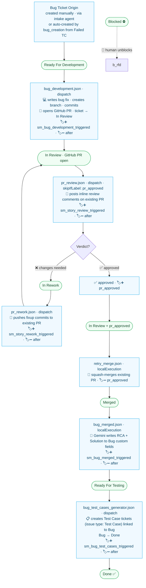
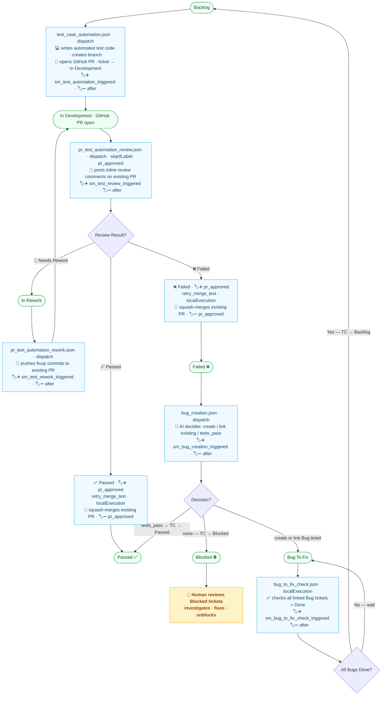
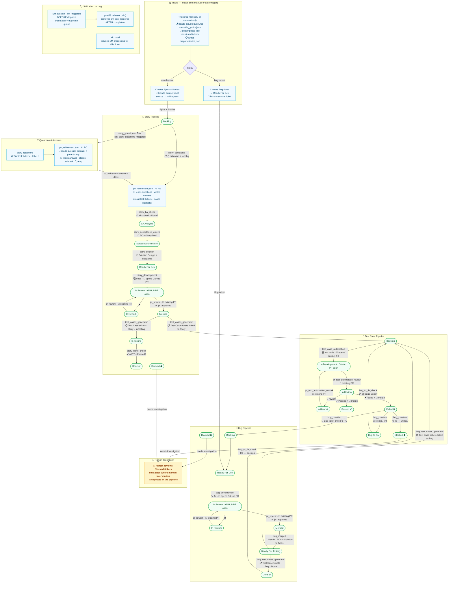

# Agents — Developer Documentation

This directory contains the configuration and JavaScript logic for the **AI-powered Scrum Master (SM) agent system**. The SM agent orchestrates a fully automated software delivery pipeline: it continuously monitors Jira, triggers specialized AI agents for each workflow stage, and manages the complete lifecycle of Stories, Bugs, and Test Cases from Backlog to Done.

---

## Table of Contents

1. [Overview](#overview)
2. [Architecture](#architecture)
3. [Pipeline Diagrams](#pipeline-diagrams)
   - [Story Pipeline](#story-pipeline)
   - [Bug Pipeline](#bug-pipeline)
   - [Test Case Pipeline](#test-case-pipeline)
4. [Full System Overview](#full-system-overview)
5. [SM Rules](#sm-rules)
6. [Agent Configs](#agent-configs)
7. [Key JS Scripts](#key-js-scripts)
8. [Label Lifecycle](#label-lifecycle)
9. [Execution Flow](#execution-flow)

---

## Overview

The SM agent system automates the Agile delivery workflow by:

- Running on a **20-minute schedule** via GitHub Actions (`sm.yml`)
- Scanning Jira using per-rule JQL queries defined in `sm.json`
- Dispatching the appropriate agent config (via `ai-teammate.yml` workflow dispatch) or running logic locally for fast/safe operations
- Using **label-based locking** to prevent duplicate processing of the same ticket
- Supporting three agent types: **Teammate** (CLI agent + prompt), **TestCasesGenerator** (DMTools job), and **JSRunner** (pure JS, no AI)

The system covers the full lifecycle: backlog refinement, acceptance criteria generation, solution design, development, PR review, test case generation, test automation, and bug management.

---

## Architecture

### SM Agent Loop

The SM agent (`smAgent.js`) is the central orchestrator. Every 20 minutes:

1. Reads all rules from `sm.json`
2. For each enabled rule, runs the JQL query against Jira
3. For each matching ticket, checks `skipIfLabel` — skips the ticket if the label is already present (lock is held)
4. Adds `addLabel` to the ticket (acquires lock)
5. Either dispatches a GitHub Actions `workflow_dispatch` to `ai-teammate.yml` (with `config_file` and `concurrency_key` inputs), **or** executes the JS logic locally (`localExecution: true`)

### Execution Modes

| Mode | When Used | Behavior |
|------|-----------|----------|
| **Dispatch** (default) | Complex AI tasks (development, review, test gen) | Triggers `ai-teammate.yml` workflow on GitHub Actions; runs asynchronously |
| **localExecution: true** | Fast/safe operations (merge checks, status checks) | Runs the postJS directly inside the SM process; synchronous |

### Agent Types

| Type | Description |
|------|-------------|
| **Teammate** | Runs a CLI agent (Cursor / GitHub Copilot / Codemie) with a markdown prompt file. `skipAI: true` means AI is driven by the CLI tool, not DMTools AI directly. |
| **TestCasesGenerator** | A specialized DMTools job that reads a Jira story/bug and generates structured Test Case tickets (issue type: Test Case) in Jira. |
| **JSRunner** | Executes a pure JavaScript file (`jsPath`) with no AI involvement. Used for orchestration (`smAgent.js`) and reporting (`workflowFailureReporter.js`). |

### Concurrency and Locking

- **`skipIfLabel`** — SM checks for this label before processing. If present, the ticket is skipped (another run already claimed it).
- **`addLabel`** — SM adds this label immediately before dispatching, serving as a distributed lock.
- The agent's **postJS** calls `releaseLock()` to remove the label once processing is complete.
- The `wip` label (or `<contextId>_wip`) can be manually applied to any ticket to **pause** SM processing for that ticket indefinitely.

---

## Pipeline Diagrams

### Story Pipeline

```mermaid
flowchart TD
    classDef humanInput fill:#fef3c7,stroke:#f59e0b,color:#92400e,font-weight:bold
    classDef action fill:#f0f9ff,stroke:#0ea5e9,color:#0c4a6e
    classDef status fill:#f0fdf4,stroke:#16a34a,color:#14532d

    s_bl([Backlog]):::status
    act_q["story_questions.json · dispatch<br/>📋 creates Question subtask tickets with label q<br/>🏷️➕ sm_story_questions_triggered · 🏷️➖ after"]:::action
    s_bl --> act_q

    act_po["po_refinement.json · dispatch<br/>🤖 AI PO reads question subtask + parent story<br/>📝 writes answer to outputs/response.md<br/>✅ closes subtask · 🏷️➖ q"]:::action
    act_q --> act_po

    act_ba["story_ba_check.json · localExecution<br/>✅ verifies all subtask tickets = Done"]:::action
    act_po --> act_ba

    s_ba([BA Analysis]):::status
    act_ba --> s_ba

    act_ac["story_acceptance_criteria.json · dispatch<br/>📥 reads Q+A subtasks via fetchQuestionsToInput<br/>📝 writes Acceptance Criteria to Story custom field<br/>🏷️➕ sm_story_acceptance_criteria_triggered · 🏷️➖ after"]:::action
    s_ba --> act_ac

    s_sa([Solution Architecture]):::status
    act_ac --> s_sa

    act_sol["story_solution.json · dispatch<br/>📐 writes Solution Design + Mermaid diagrams to Story field<br/>🏷️➕ sm_story_solution_triggered · 🏷️➖ after"]:::action
    s_sa --> act_sol

    s_rfd([Ready For Development]):::status
    act_sol --> s_rfd

    act_dev["story_development.json · dispatch<br/>💻 writes feature code · creates branch · commits<br/>🔀 opens GitHub PR · ticket → In Review<br/>🏷️➕ sm_story_development_triggered · 🏷️➖ after"]:::action
    s_rfd --> act_dev

    s_inr(["In Review · GitHub PR open"]):::status
    act_dev --> s_inr

    act_rev["pr_review.json · dispatch · skipIfLabel: pr_approved<br/>💬 posts inline review comments on existing PR<br/>🏷️➕ sm_story_review_triggered · 🏷️➖ after"]:::action
    s_inr --> act_rev

    dec_rev{Verdict?}
    act_rev --> dec_rev

    s_rwk([In Rework]):::status
    dec_rev -->|"❌ changes needed"| s_rwk

    act_rwk["pr_rework.json · dispatch<br/>📝 pushes fixup commits to existing PR<br/>addresses review threads<br/>🏷️➕ sm_story_rework_triggered · 🏷️➖ after"]:::action
    s_rwk --> act_rwk
    act_rwk --> s_inr

    act_approve["✅ approved<br/>🏷️➕ pr_approved"]:::action
    dec_rev -->|"✅ approved"| act_approve

    s_app(["In Review + pr_approved"]):::status
    act_approve --> s_app

    act_merge["retry_merge.json · localExecution<br/>🔀 squash-merges existing PR<br/>🏷️➖ pr_approved"]:::action
    s_app --> act_merge

    s_mrg([Merged]):::status
    act_merge --> s_mrg

    act_tc["test_cases_generator.json · dispatch<br/>📋 creates Test Case tickets (issue type: Test Case) linked to Story<br/>Story → In Testing<br/>🏷️➕ sm_test_cases_triggered · 🏷️➖ after"]:::action
    s_mrg --> act_tc

    s_int([In Testing]):::status
    act_tc --> s_int

    act_done["story_done_check.json · localExecution<br/>✅ checks all linked Test Case tickets = Passed"]:::action
    s_int --> act_done

    s_don([Done ✅]):::status
    act_done --> s_don

    s_blocked([Blocked ⛔]):::status
    s_blocked -.->|"👤 human unblocks"| s_bl
```





### Test Case Pipeline



---

## Full System Overview

Cross-pipeline view: how intake creates tickets, how stories/bugs/TCs relate to each other, how the SM label locking system works, and how questions, test cases, and bugs flow between pipelines. Each pipeline's PR lifecycle is shown inline — **the GitHub PR is opened once** (by `story_development` / `bug_development` / `test_case_automation`) and the same PR is then reviewed, reworked, and finally squash-merged.



---

## SM Rules

All rules are defined in `sm.json`. The SM agent evaluates them in order on every cycle.

| # | Description | JQL Condition | Config File | Mode | Enabled |
|---|-------------|--------------|-------------|------|---------|
| 1 | PO Review Stories with all subtasks Done → BA Analysis | Story status = `PO Review` | `story_ba_check.json` | localExecution | ✅ |
| 2 | BA Analysis Stories → generate Acceptance Criteria | Story status = `BA Analysis` | `story_acceptance_criteria.json` | dispatch | ✅ |
| 3 | Solution Architecture Stories → generate Solution Design | Story status = `Solution Architecture` | `story_solution.json` | dispatch | ✅ |
| 4 | Subtasks with `q` label → trigger PO refinement | Subtask labels = `q`, status ≠ `Done` | `po_refinement.json` | dispatch | ✅ |
| 5 | Backlog Stories → ask clarification questions | Story status = `Backlog` | `story_questions.json` | dispatch | ✅ |
| 6 | Ready For Development Stories → trigger story_development | Story status = `Ready For Development` | `story_development.json` | dispatch | ✅ |
| 7 | Ready For Development Bugs → trigger bug_development | Bug status = `Ready For Development` | `bug_development.json` | dispatch | ✅ |
| 8 | In Review Stories & Bugs (no `pr_approved`) → trigger pr_review | Story\|Bug status = `In Review` AND labels NOT IN `pr_approved` | `pr_review.json` | dispatch | ✅ |
| 9 | In Review Stories & Bugs (`pr_approved`) → retry merge | Story\|Bug status = `In Review` AND labels = `pr_approved` | `retry_merge.json` | localExecution | ✅ |
| 10 | In Review Test Cases (`pr_approved`) → retry merge | Test Case status = `In Review-Passed\|Failed` AND labels = `pr_approved` | `retry_merge_test.json` | localExecution | ✅ |
| 11 | In Rework Stories & Bugs → trigger pr_rework | Story\|Bug status = `In Rework` | `pr_rework.json` | dispatch | ✅ |
| 12 | Merged Stories → Ready For Testing + generate test cases | Story status = `Merged` | `test_cases_generator.json` | dispatch | ✅ |
| 13 | Merged Bugs → Ready For Testing | Bug status = `Merged` | `bug_merged.json` | localExecution (limit 1) | ✅ |
| 14 | Ready For Testing Bugs → generate test cases | Bug status = `Ready For Testing` | `bug_test_cases_generator.json` | dispatch | ✅ |
| 15 | In Testing Stories → check all TCs passed → Done | Story status = `In Testing` | `story_done_check.json` | localExecution | ✅ |
| 16 | In Testing Bugs → check all TCs passed → Done | Bug status = `In Testing` | `bug_done_check.json` | localExecution | ❌ disabled |
| 17 | Backlog Test Cases → In Development + automate | Test Case status = `Backlog` | `test_case_automation.json` | dispatch | ✅ |
| 18 | In Review Test Cases (no `pr_approved`) → trigger pr_test_automation_review | Test Case status = `In Review-Passed\|Failed` AND labels NOT IN `pr_approved` | `pr_test_automation_review.json` | dispatch | ✅ |
| 19 | In Rework Test Cases → trigger pr_test_automation_rework | Test Case status = `In Rework` | `pr_test_automation_rework.json` | dispatch | ✅ |
| 20 | Failed Test Cases → create or link bug | Test Case status = `Failed` | `bug_creation.json` | dispatch (limit 1) | ✅ |
| 21 | Bug To Fix Test Cases → all linked Bugs Done → move to Backlog | Test Case status = `Bug To Fix` | `bug_to_fix_check.json` | localExecution | ✅ |

---

## Agent Configs

All config files live in the `agents/js/` directory and are consumed by the `ai-teammate.yml` GitHub Actions workflow.

| Config File | Agent Type | Purpose | CLI Prompt | preJS | postJS |
|-------------|-----------|---------|------------|-------|--------|
| `bug_creation.json` | Teammate (skipAI) | Analyze a failed test case and decide whether to create a new bug, link an existing one, or mark tests as passing | `bug_creation_prompt.md` | `checkWipLabel.js` | `postBugCreation.js` |
| `bug_development.json` | Teammate (skipAI) | Implement a bug fix on a feature branch and open a PR | `bug_development_prompt.md` | `checkWipLabel.js` | `developBugAndCreatePR.js` |
| `bug_done_check.json` | Teammate (skipAI) | Check whether all test cases for a Bug in In Testing have passed, then transition to Done | — | — | `checkBugTestsPassed.js` |
| `bug_merged.json` | Teammate (skipAI) | Handle a Bug that has been merged — transition to Ready For Testing and populate RCA/Solution via Gemini | — | — | `notifyBugMerged.js` |
| `bug_test_cases_generator.json` | TestCasesGenerator | Generate structured Jira test cases from a Bug description after it moves to Ready For Testing | — | `moveToReadyForTesting.js` | `moveToDone.js` |
| `bug_to_fix_check.json` | Teammate (skipAI) | Check if all bugs linked to a "Bug To Fix" Test Case are Done; if so, move TC back to Backlog | — | — | `checkBugToFixReady.js` |
| `po_refinement.json` | Teammate (skipAI) | Answer open questions (label `q`) on subtasks by running a PO refinement AI pass | `po_refinement_prompt.md` | — | `closeQuestionTicket.js` |
| `pr_review.json` | Teammate (skipAI) | Review an open PR, post inline comments, and either approve (add `pr_approved`) or move to In Rework | `pr_review_prompt.md` | `checkWipLabel.js` | `postPRReviewComments.js` |
| `pr_rework.json` | Teammate (skipAI) | Apply the reviewer's feedback to the branch and push updated commits | `pr_rework_prompt.md` | `checkWipLabel.js` | `pushReworkChanges.js` |
| `pr_test_automation_review.json` | Teammate (skipAI) | Review a test automation PR, post comments, and approve or move to In Rework | `pr_test_automation_review_prompt.md` | `checkWipLabel.js` | `postTestReviewComments.js` |
| `pr_test_automation_rework.json` | Teammate (skipAI) | Apply reviewer feedback to a test automation branch and push updated commits | `pr_test_automation_rework_prompt.md` | `checkWipLabel.js` | `postTestReworkResults.js` |
| `retry_merge.json` | Teammate (skipAI) | Attempt to squash-merge an approved Story/Bug PR and transition ticket to Merged | — | — | `retryMergePR.js` |
| `retry_merge_test.json` | Teammate (skipAI) | Attempt to squash-merge an approved Test Case PR and transition ticket to Passed or Failed | — | — | `retryMergePR.js` |
| `sm.json` | JSRunner | SM orchestrator — runs smAgent.js every 20 min via schedule; no AI involved | — | — | `smAgent.js` (jsPath) |
| `story_acceptance_criteria.json` | Teammate (skipAI) | Generate an enhanced story-ready Acceptance Criteria field for a story in BA Analysis and move to Solution Architecture | `acceptance_criteria_prompt.md` | `fetchQuestionsToInput.js` | `assignForSolutionArchitecture.js` |
| `story_acceptance_criterias.json` | Teammate (skipAI) | Compatibility alias for older workflows; prefer `story_acceptance_criteria.json` | `acceptance_criteria_prompt.md` | `fetchQuestionsToInput.js` | `assignForSolutionArchitecture.js` |
| `story_ba_check.json` | Teammate (skipAI) | Verify all subtasks of a PO Review story are Done before advancing to BA Analysis | — | — | `checkSubtasksDoneForBA.js` |
| `story_development.json` | Teammate (skipAI) | Implement a story on a feature branch following the solution design and open a PR | `story_development_prompt.md` | `checkWipLabel.js` | `developTicketAndCreatePR.js` |
| `story_done_check.json` | Teammate (skipAI) | Check whether all test cases for a Story in In Testing have passed, then transition to Done | — | — | `checkStoryTestsPassed.js` |
| `story_questions.json` | Teammate (skipAI) | Generate clarification question subtasks for a Backlog story and assign it for PO Review | `questions_prompt.md` | `fetchQuestionsToInput.js` | `createQuestionsAndAssignForReview.js` |
| `story_solution.json` | Teammate (skipAI) | Write a solution design document and architecture diagrams for a story in Solution Architecture | `story_solution_prompt.md` | `checkWipLabel.js` | `writeSolutionAndDiagrams.js` |
| `test_case_automation.json` | Teammate (skipAI) | Write automated test code for a Backlog Test Case and push to a branch for review | `test_case_automation_prompt.md` | `checkWipLabel.js` | `postTestAutomationResults.js` |
| `test_cases_generator.json` | TestCasesGenerator | Generate structured Jira test cases from a merged Story and move ticket to In Testing | — | `moveToReadyForTesting.js` | `moveToInTesting.js` |
| `workflow_failure_reporter.json` | JSRunner | Monitor GitHub Actions workflow runs and create/update Jira bugs for CI failures | — | — | `workflowFailureReporter.js` (jsPath) |

---

## Story Template Customization

Story/AC generation separates task instructions from formatting so each repository can customize output safely:

| File | Purpose |
|------|---------|
| `prompts/acceptance_criteria_prompt.md` | Runtime task flow: read input, use answered questions, write `outputs/response.md` |
| `instructions/story/enhanced_story_content_guidelines.md` | Content guidance: story points, business context, testable ACs, business rules, out of scope |
| `instructions/story/enhanced_story_formatting.md` | Tracker-agnostic story output structure and section order |
| `instructions/tracker/jira_markup_transform.md` | Converts generic tags to Jira wiki markup |
| `instructions/tracker/ado_markup_transform.md` | Converts generic tags to Azure DevOps Markdown |

Project repositories can override or append their own guidance from `.dmtools/config.js`:

```js
module.exports = {
  additionalInstructions: {
    story_acceptance_criteria: [
      './.dmtools/instructions/product/domain_rules.md'
    ]
  },
  agentParamPatches: {
    story_acceptance_criteria: {
      formattingRules: './.dmtools/instructions/product/jira_story_template.md'
    }
  }
};
```

Use `additionalInstructions` for domain/content rules. Use `agentParamPatches.story_acceptance_criteria.formattingRules` when a repository needs a different output format, for example a custom Jira story template.

---

## Key JS Scripts

All scripts are located in `agents/js/`.

### Orchestration

| Script | Description |
|--------|-------------|
| `smAgent.js` | Core SM orchestrator. Reads `sm.json` rules, runs JQL queries against Jira, checks/adds labels, and either dispatches `ai-teammate.yml` via GitHub Actions API or executes local JS functions. Runs on a 20-minute cron. |
| `workflowFailureReporter.js` | Polls GitHub Actions for failed workflow runs and creates or updates a Jira bug with failure details. Used for CI health monitoring. |

### Development & PR

| Script | Description |
|--------|-------------|
| `developTicketAndCreatePR.js` | Creates a feature branch from the story key, invokes the CLI agent with the development prompt, commits changes, pushes the branch, and opens a GitHub PR linked to the Jira ticket. |
| `developBugAndCreatePR.js` | Same as above but adapted for bug tickets — includes bug-specific context (affected area, reproduction steps) in the branch and commit conventions. |
| `retryMergePR.js` | Checks PR mergeability (labels, CI status), performs a squash merge via GitHub API, and transitions the Jira ticket to `Merged` (Stories/Bugs) or `Passed`/`Failed` (Test Cases). Also clears merge-related labels. |
| `pushReworkChanges.js` | Applies rework changes produced by the CLI agent to the existing PR branch, force-pushes, and updates the PR description with a rework summary. |
| `postTestReworkResults.js` | Parses test automation rework output from the CLI agent, pushes changes to the test branch, and moves the Test Case to `In Review-Passed` or `In Review-Failed`. |

### PR Review

| Script | Description |
|--------|-------------|
| `postPRReviewComments.js` | Parses the CLI agent's review output, posts inline GitHub PR review comments, and either approves the PR (adds `pr_approved` label to Jira ticket) or transitions the ticket to `In Rework`. |
| `postTestReviewComments.js` | Same as `postPRReviewComments.js` but for test automation PRs — posts inline comments and updates Test Case status to `In Review-Passed`, `In Review-Failed`, or `In Rework`. |

### Test Cases & Bugs

| Script | Description |
|--------|-------------|
| `postTestAutomationResults.js` | Parses the CLI agent's test automation output, commits generated test code to a branch, creates a PR, and moves the Test Case to `In Review-Passed` or `In Review-Failed`. |
| `postBugCreation.js` | Parses the AI decision for a Failed Test Case: `create` (create a new Jira Bug and link it), `link` (link an existing Bug), `none` (no bug needed), or `tests_pass` (mark TC as Passed). |
| `checkBugToFixReady.js` | Fetches all Bugs linked to a "Bug To Fix" Test Case and checks if every one is in `Done`. If so, transitions the TC back to `Backlog` for re-automation. |
| `checkStoryTestsPassed.js` | Checks whether all Test Case tickets linked to a Story in `In Testing` have status `Passed`. If yes, transitions the Story to `Done`. |
| `checkBugTestsPassed.js` | Same as above but for Bugs. |

### Story Lifecycle

| Script | Description |
|--------|-------------|
| `checkSubtasksDoneForBA.js` | Verifies that all subtasks of a `PO Review` Story are in `Done` status before advancing the Story to `BA Analysis`. |
| `assignForSolutionArchitecture.js` | After AC generation, updates the Story with the generated Acceptance Criteria and transitions it to `Solution Architecture`. |
| `writeSolutionAndDiagrams.js` | Saves the CLI agent's solution design output (text + Mermaid diagrams) to the Jira Story's description/custom field and moves it to `Ready For Development`. |
| `createQuestionsAndAssignForReview.js` | Creates question subtasks in Jira from the AI output and moves the Story to `PO Review`. |

### Input Fetchers (preCliJSAction)

| Script | Description |
|--------|-------------|
| `fetchQuestionsToInput.js` | Fetches existing question subtasks (label `q`) for a Story and injects them as context into the CLI agent prompt, preventing duplicate questions. |
| `fetchEpicsToInput.js` | Fetches active Epics and their Stories with custom fields and injects them into the intake agent prompt for proper hierarchy mapping. |

### Utility

| Script | Description |
|--------|-------------|
| `checkWipLabel.js` | Checks whether the ticket has a `wip` label (or `<contextId>_wip`). If present, skips all further processing for this run. |
| `moveToReadyForTesting.js` | Transitions a Jira Story or Bug to `Ready For Testing` status (used as preJS for test case generation configs). |
| `moveToInTesting.js` | Transitions a Jira Story to `In Testing` after test cases have been generated. |
| `moveToDone.js` | Transitions a Jira ticket to `Done` (used as postJS after test case generation for bugs). |
| `notifyBugMerged.js` | When a Bug is merged, calls the Gemini API to generate an RCA and Solution summary and writes it back to the Jira Bug's custom fields. |
| `closeQuestionTicket.js` | Marks the `q`-labelled question subtask as `Done` and removes the `q` label after PO refinement. |
| `createIntakeTickets.js` | Parses the AI-structured intake output and creates Epics and Stories in Jira with correct field mappings, links, and assignees. |

---

## Label Lifecycle

Labels are the primary mechanism for distributed locking and state signaling between the SM agent and individual agent runs.

### Processing Lock Labels (`sm_xxx_triggered`)

These labels are added by SM **before** dispatching an agent and removed by the agent's postJS via `releaseLock()` **after** completion.

| Label | Set By | Cleared By | Purpose |
|-------|--------|------------|---------|
| `sm_story_questions_triggered` | SM (story_questions) | `createQuestionsAndAssignForReview.js` | Prevents duplicate question generation for Backlog stories |
| `sm_story_acceptance_criteria_triggered` | SM (story_acceptance_criteria) | `assignForSolutionArchitecture.js` | Prevents duplicate AC generation |
| `sm_story_acceptance_criterias_triggered` | SM (legacy story_acceptance_criterias) | `assignForSolutionArchitecture.js` | Legacy duplicate-prevention label; SM still skips tickets with this label |
| `sm_story_solution_triggered` | SM (story_solution) | `writeSolutionAndDiagrams.js` | Prevents duplicate solution design generation |
| `sm_story_development_triggered` | SM (story_development) | `developTicketAndCreatePR.js` | Prevents duplicate development runs |
| `sm_bug_development_triggered` | SM (bug_development) | `developBugAndCreatePR.js` | Prevents duplicate bug fix runs |
| `sm_story_review_triggered` | SM (pr_review / pr_rework) | `postPRReviewComments.js` / `pushReworkChanges.js` | Prevents duplicate PR review/rework |
| `sm_story_rework_triggered` | SM (pr_rework) | `pushReworkChanges.js` | Prevents duplicate rework runs |
| `sm_test_cases_triggered` | SM (test_cases_generator) | `moveToInTesting.js` | Prevents duplicate test case generation for stories |
| `sm_bug_merged_triggered` | SM (bug_merged) | `notifyBugMerged.js` | Prevents duplicate bug merge notifications |
| `sm_bug_test_cases_triggered` | SM (bug_test_cases_generator) | `moveToDone.js` | Prevents duplicate test case generation for bugs |
| `sm_test_automation_triggered` | SM (test_case_automation) | `postTestAutomationResults.js` | Prevents duplicate test automation runs |
| `sm_test_review_triggered` | SM (pr_test_automation_review) | `postTestReviewComments.js` | Prevents duplicate test PR review runs |
| `sm_test_rework_triggered` | SM (pr_test_automation_rework) | `postTestReworkResults.js` | Prevents duplicate test rework runs |
| `sm_bug_creation_triggered` | SM (bug_creation) | `postBugCreation.js` | Prevents duplicate bug creation for failed TCs |
| `sm_bug_to_fix_check_triggered` | SM (bug_to_fix_check) | `checkBugToFixReady.js` | Prevents duplicate Bug-To-Fix checks |
| `sm_po_refinement_triggered` | SM (po_refinement) | `closeQuestionTicket.js` | Prevents duplicate PO refinement runs |

### State Signal Labels

These labels are used to communicate state between agent runs and are not simple processing locks.

| Label | Set By | Cleared By | Meaning |
|-------|--------|------------|---------|
| `pr_approved` | `postPRReviewComments.js` / `postTestReviewComments.js` | `retryMergePR.js` | PR has been reviewed and approved; SM will trigger retry_merge on next cycle |
| `pr_merge_triggered` | `retryMergePR.js` | `retryMergePR.js` | Temporary lock during the merge operation to prevent concurrent merge attempts |

### Pause Labels

| Label | Set By | Cleared By | Meaning |
|-------|--------|------------|---------|
| `wip` | Developer (manually) | Developer (manually) | Pauses all SM processing for this ticket indefinitely — used when a developer needs to take manual control |
| `<contextId>_wip` | Developer (manually) | Developer (manually) | Scoped `wip` label — pauses SM only for the specific agent context matching this ticket's context ID |

---

## Execution Flow

### Full Dispatch Flow (Teammate agent)

This is the standard flow for agents that require CLI-based AI execution:

```
SM Agent (smAgent.js)
│
├─ 1. Run JQL → find matching Jira tickets
├─ 2. For each ticket:
│     ├─ Check skipIfLabel → skip if present (ticket is locked)
│     ├─ Add addLabel to Jira ticket (acquire lock)
│     └─ Dispatch workflow_dispatch to ai-teammate.yml
│           inputs: { config_file, concurrency_key }
│
ai-teammate.yml (GitHub Actions)
│
├─ 3. Load config_file (e.g., story_development.json)
├─ 4. Run preJSAction (e.g., checkWipLabel.js)
│     └─ If wip label found → abort early, release lock
├─ 5. Run preCliJSAction (optional, e.g., fetchQuestionsToInput.js)
│     └─ Fetches extra context and injects into prompt variables
├─ 6. Invoke CLI Agent (Cursor / GitHub Copilot / Codemie)
│     └─ Uses cliPrompt markdown file as the task specification
│     └─ CLI agent reads Jira ticket, writes code, runs commands
├─ 7. Run postJSAction (e.g., developTicketAndCreatePR.js)
│     ├─ Parses CLI agent output
│     ├─ Creates PR, posts comments, transitions Jira status, etc.
│     └─ Calls releaseLock() → removes addLabel from Jira ticket
```

### Local Execution Flow (localExecution: true)

Used for synchronous, lightweight operations that don't need a full GitHub Actions runner:

```
SM Agent (smAgent.js)
│
├─ 1. Run JQL → find matching Jira tickets
├─ 2. For each ticket:
│     ├─ Check skipIfLabel → skip if present
│     └─ Run postJS function directly in-process (e.g., retryMergePR.js)
│           ├─ No label locking (localExecution rules often omit addLabel)
│           ├─ Executes synchronously
│           └─ Transitions Jira ticket status or performs merge operation
```

### TestCasesGenerator Flow

```
SM Agent → dispatch ai-teammate.yml with test_cases_generator.json
│
├─ preJS: moveToReadyForTesting.js → transition Story/Bug to Ready For Testing
├─ DMTools TestCasesGenerator job:
│     └─ Reads story/bug description, acceptance criteria, solution design
│     └─ Generates structured Test Case tickets (issue type: Test Case) in Jira
└─ postJS: moveToInTesting.js / moveToDone.js → advance parent ticket
```

### JSRunner Flow (SM / WorkflowFailureReporter)

```
GitHub Actions schedule trigger (sm.yml, every 20 min)
│
└─ Run sm.json config → JSRunner type
      └─ Execute jsPath: smAgent.js directly
            └─ Full SM cycle (see above)
```

---

## Jira Workflow Statuses Reference

### Stories
```
Backlog → PO Review → BA Analysis → Solution Architecture → Ready For Development
→ In Development → In Review → [In Rework] → Merged → Ready For Testing → In Testing → Done
```

### Bugs
```
Backlog → Ready For Development → In Development → In Review → [In Rework]
→ Merged → Ready For Testing → In Testing → Done
```

### Test Cases
```
Backlog → In Development → In Review (Passed or Failed) → [In Rework]
→ Passed / Failed → [Bug To Fix]
```

---

## Project Configuration

The agents module supports **project-specific configuration** via `.dmtools/config.js`, enabling reuse across different repositories and Jira projects without forking.

### Configuration File

Place a `config.js` file at `<project-root>/.dmtools/config.js`. The file is a CommonJS module exporting a configuration object.

**Discovery order:**
1. `customParams.configPath` — explicit path (for cross-repo workflows)
2. `../.dmtools/config.js` — relative to agents directory (submodule layout)
3. `.dmtools/config.js` — current working directory
4. Built-in defaults — backward compatible (no config = current behavior)

### Minimal Configuration

Only specify what differs from defaults:

```js
// .dmtools/config.js
module.exports = {
    repository: {
        owner: 'your-org',
        repo: 'your-repo'
    },
    jira: {
        project: 'PROJ',
        parentTicket: 'PROJ-1'
    },
    git: {
        baseBranch: 'master'  // default is 'main'
    }
};
```

### Full Configuration Reference

```js
module.exports = {
    // Repository identity (used for workflow dispatch and PR creation)
    repository: {
        owner: 'your-org',
        repo: 'your-repo'
    },

    jira: {
        project: 'PROJ',         // Replaces {jiraProject} in JQL queries
        parentTicket: 'PROJ-1',  // Replaces {parentTicket} in JQL queries

        // Full replacement — define your project's complete status set
        statuses: {
            IN_REVIEW: 'In Review',
            READY_FOR_DEVELOPMENT: 'Ready For Development',
            IN_DEVELOPMENT: 'In Development',
            DONE: 'Done',
            // ... see config.js for all default status keys
        },

        // Override issue type names if different
        issueTypes: {
            STORY: 'Story',
            BUG: 'Bug',
            TASK: 'Task'
        }
    },

    git: {
        baseBranch: 'main',
        authorName: 'AI Teammate',
        authorEmail: 'agent.ai.native@gmail.com',
        branchPrefix: {
            development: 'ai',      // ai/<TICKET-KEY>
            feature: 'feature',     // feature/<TICKET-KEY>
            test: 'test'            // test/<TICKET-KEY>
        }
    },

    // Template placeholders: {ticketKey}, {ticketSummary}, {result}
    formats: {
        commitMessage: {
            development: '{ticketKey} {ticketSummary}',
            testAutomation: '{ticketKey} test: automate {ticketSummary}',
            testRework: '{ticketKey} test rework: {result} test after review',
            rework: '{ticketKey} Rework: address PR review comments',
            wip: '{ticketKey} WIP: partial analysis (agent interrupted)'
        },
        prTitle: {
            development: '{ticketKey} {ticketSummary}',
            testAutomation: '{ticketKey} {ticketSummary}',
            rework: '{ticketKey} {ticketSummary} (rework)'
        }
    },

    // Full replacement — define your project's complete label set
    labels: {
        AI_GENERATED: 'ai_generated',
        AI_DEVELOPED: 'ai_developed',
        PR_APPROVED: 'pr_approved'
        // ... see config.js for all default label keys
    },

    // Override Confluence page URLs per project
    confluence: {
        templateStory: 'https://your-confluence/wiki/spaces/PROJ/pages/123/Template+Story',
        templateJiraMarkdown: 'https://your-confluence/wiki/spaces/PROJ/pages/456/Jira+Markdown',
        templateSolutionDesign: 'https://your-confluence/wiki/spaces/PROJ/pages/789/Solution+Design',
        templateQuestions: 'https://your-confluence/wiki/spaces/PROJ/pages/012/Questions'
    },

    // Fully replace SM rules for projects with different workflows
    // Set to null to use default rules with JQL interpolation
    smRules: null,

    // Add project-specific instructions to agents (appended, not replacing defaults)
    // Uses dmtools-core's additionalInstructions field
    additionalInstructions: {
        story_development: [
            'https://your-confluence/wiki/spaces/PROJ/pages/100/Dev+Guidelines',
            './project-instructions/coding-standards.md'
        ]
    },

    // Fully replace agent instructions (overrides defaults entirely)
    instructionOverrides: {
        // story_development: ['./custom-instructions/dev.md']
    }
};
```

### Merge Strategy

| Section | Behavior | Use case |
|---------|----------|----------|
| `repository`, `git`, `formats`, `confluence` | Deep merge | Override individual fields |
| `jira.statuses`, `jira.issueTypes`, `labels` | Full replacement | Projects with different workflows |
| `smRules`, `smMergeRules` | Full replacement | Completely different SM rules |
| `additionalInstructions`, `instructionOverrides` | Full replacement per key | Project-specific agent instructions |

### Deployment Modes

#### Mode 1: Agents as Git Submodule (recommended)

```
your-project/
├── .dmtools/
│   └── config.js          ← project config
├── agents/                ← git submodule (this repo)
│   ├── sm.json
│   ├── js/
│   └── ...
└── .github/
    └── workflows/
        └── ai-teammate.yml
```

Agents automatically discover `../.dmtools/config.js`.

#### Mode 2: Isolated Agents Repo (cross-repo workflows)

When agents live in a separate repository and operate on other repos:

```json
{
  "customParams": {
    "targetRepository": {
      "owner": "your-org",
      "repo": "target-repo",
      "baseBranch": "master",
      "workingDir": "target-repo"
    }
  }
}
```

The `targetRepository` in `customParams` overrides the config's repository settings at runtime, allowing the same agent to work with different target repositories.

### JQL Parameterization

SM rules in `sm.json` use `{jiraProject}` and `{parentTicket}` placeholders:

```json
{
  "jql": "project = {jiraProject} AND issuetype in ('Story') AND status in ('Backlog')"
}
```

These are resolved at runtime from the project config. To fully replace all SM rules for a project with a completely different workflow, set `smRules` in the config to an array of rule objects.
