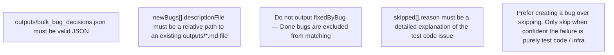

```mermaid
flowchart TD
    F1["outputs/bulk_bug_decisions.json must be valid JSON"]
    F2["newBugs[].descriptionFile must be a relative path to an existing outputs/*.md file"]
    F3["Do not output fixedByBug — Done bugs are excluded from matching"]
    F4["skipped[].reason must be a detailed explanation of the test code issue"]
    F5["Prefer creating a bug over skipping. Only skip when confident the failure is purely test code / infra"]
```
