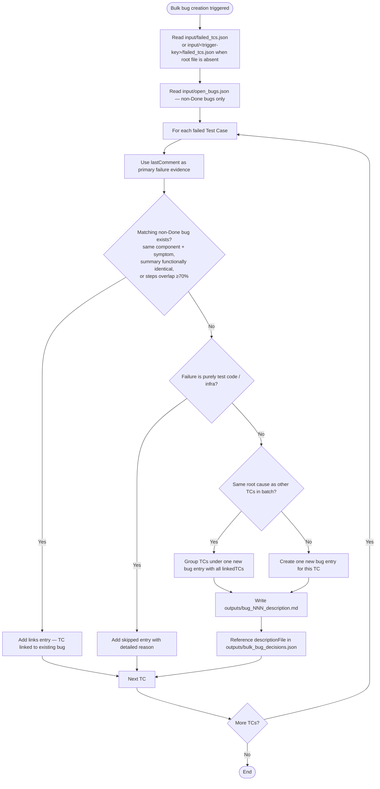

```mermaid
flowchart TD
    START([Bulk bug creation triggered]) --> READ_TC["Read input/failed_tcs.json<br/>or input/&lt;trigger-key&gt;/failed_tcs.json when root file is absent"]
    READ_TC --> READ_BUGS["Read input/open_bugs.json — non-Done bugs only"]
    READ_BUGS --> LOOP[For each failed Test Case]
    LOOP --> EVAL[Use lastComment as primary failure evidence]
    EVAL --> MATCH{Matching non-Done bug exists?<br/>same component + symptom,<br/>summary functionally identical,<br/>or steps overlap ≥70%}
    MATCH -->|Yes| LINK[Add links entry — TC linked to existing bug]
    MATCH -->|No| ROOT{Failure is purely test code / infra?}
    ROOT -->|Yes| SKIP[Add skipped entry with detailed reason]
    ROOT -->|No| GROUP{Same root cause as other TCs in batch?}
    GROUP -->|Yes| GROUP_BUG[Group TCs under one new bug entry with all linkedTCs]
    GROUP -->|No| NEW[Create one new bug entry for this TC]
    LINK --> NEXT[Next TC]
    SKIP --> NEXT
    GROUP_BUG --> DESC[Write outputs/bug_NNN_description.md]
    NEW --> DESC
    DESC --> DECISION[Reference descriptionFile in outputs/bulk_bug_decisions.json]
    DECISION --> NEXT
    NEXT --> MORE{More TCs?}
    MORE -->|Yes| LOOP
    MORE -->|No| END([End])
```
