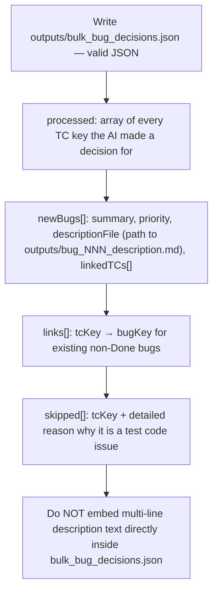

```mermaid
flowchart TD
    O1["Write outputs/bulk_bug_decisions.json — valid JSON"]
    O2["processed: array of every TC key the AI made a decision for"]
    O3["newBugs[]: summary, priority, descriptionFile (path to outputs/bug_NNN_description.md), linkedTCs[]"]
    O4["links[]: tcKey → bugKey for existing non-Done bugs"]
    O5["skipped[]: tcKey + detailed reason why it is a test code issue"]
    O6["Do NOT embed multi-line description text directly inside bulk_bug_decisions.json"]
    O1 --> O2 --> O3 --> O4 --> O5 --> O6
```
