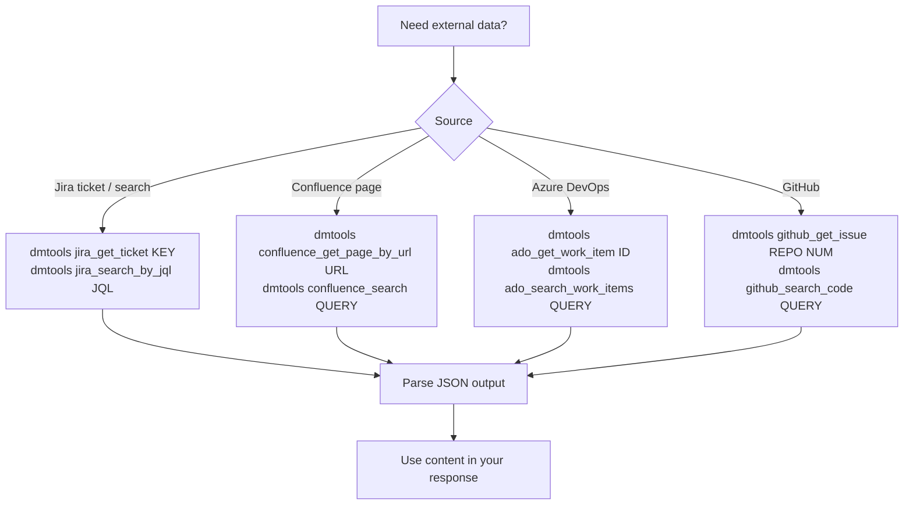

## DMTools CLI — External Data Access

When you need additional context from Jira, Confluence, ADO, or GitHub that is not already
in the `input/` folder, use the `dmtools` CLI directly via shell commands.



### When to use dmtools CLI

- Confluence pages linked in the ticket were **not** written to `input/confluence/`
  (e.g. Confluence is on a different domain or not configured)
- You need to fetch a **related Jira ticket** mentioned in the description
- You need **ADO work items**, **GitHub issues**, or **pull requests** for context
- You need to **search** for similar tickets or pages

### Examples

```bash
# Fetch a Confluence page by URL
dmtools confluence_get_page_by_url "https://wiki.example.com/wiki/spaces/SPACE/pages/123/Title"

# Get a Jira ticket
dmtools jira_get_ticket PROJ-456

# Search Confluence
dmtools confluence_search "sample sheet parser specification"

# Search Jira
dmtools jira_search_by_jql "project = PROJ AND summary ~ 'sample sheet'"
```

### Guidelines

1. **Check `input/` first** — read `input/*/confluence/` and `input/*/request.md` before
   making external calls to avoid redundant fetches.
2. **Use dmtools only when needed** — don't fetch data that is already available locally.
3. **Handle errors gracefully** — dmtools may return an error if a resource is not accessible;
   continue with available information and note the missing context.
4. **Cite sources** — when using data fetched via dmtools, mention the source in your response.
