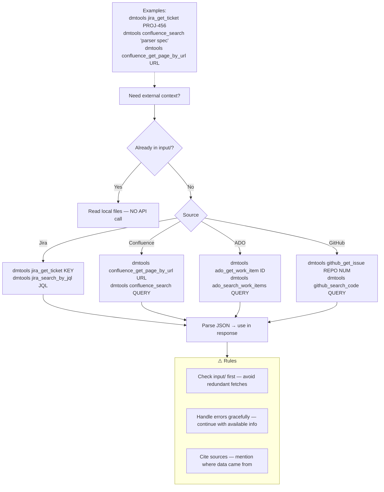

## DMTools CLI — External Data Access

> **PR Review note**: Ticket/PR context is pre-loaded. Use dmtools only for additional data (e.g., parent story details, linked tickets not in input/).

Use `dmtools` CLI only when data is **not** already in `input/`.

