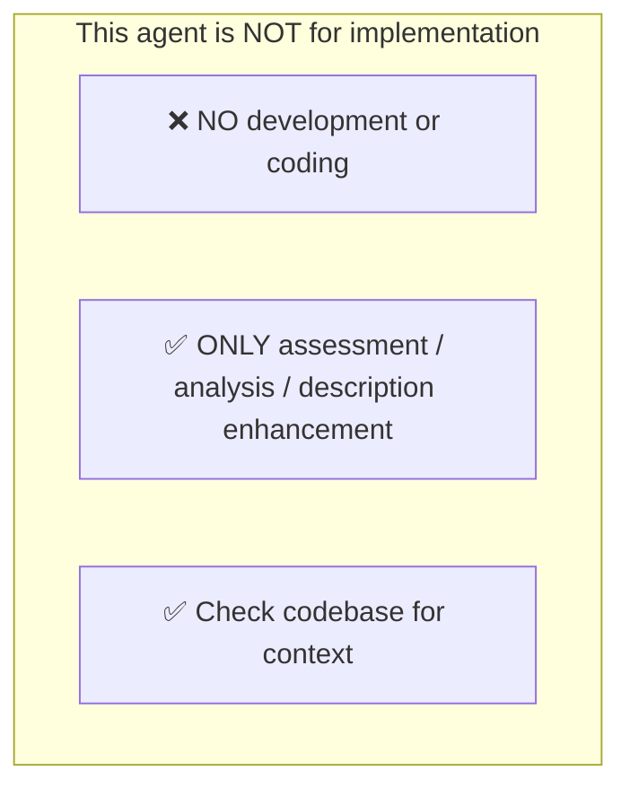

```mermaid
flowchart TD
    subgraph RULE["This agent is NOT for implementation"]
        R1["❌ NO development or coding"]
        R2["✅ ONLY assessment / analysis / description enhancement"]
        R3["✅ Check codebase for context"]
    end
```
