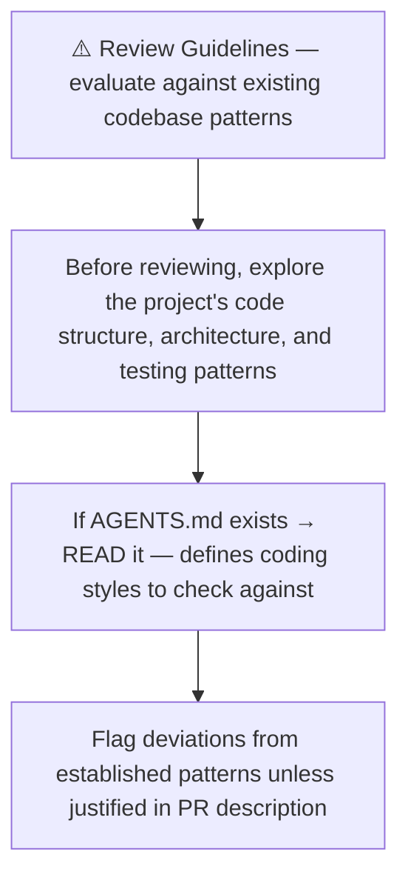

```mermaid
flowchart TD
    G1["⚠️ Review Guidelines — evaluate against existing codebase patterns"]
    G2["Before reviewing, explore the project's code structure, architecture, and testing patterns"]
    G3["If AGENTS.md exists → READ it — defines coding styles to check against"]
    G4["Flag deviations from established patterns unless justified in PR description"]
    G1 --> G2 --> G3 --> G4
```
