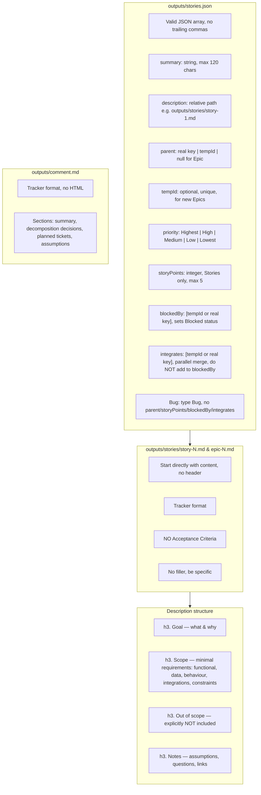

```mermaid
flowchart TD
    subgraph STORIES_JSON["outputs/stories.json"]
        J1["Valid JSON array, no trailing commas"]
        J2["summary: string, max 120 chars"]
        J3["description: relative path e.g. outputs/stories/story-1.md"]
        J4["parent: real key | tempId | null for Epic"]
        J5["tempId: optional, unique, for new Epics"]
        J6["priority: Highest | High | Medium | Low | Lowest"]
        J7["storyPoints: integer, Stories only, max 5"]
        J8["blockedBy: [tempId or real key], sets Blocked status"]
        J9["integrates: [tempId or real key], parallel merge, do NOT add to blockedBy"]
        J10["Bug: type Bug, no parent/storyPoints/blockedBy/integrates"]
    end

    subgraph COMMENT["outputs/comment.md"]
        C1["Tracker format, no HTML"]
        C2["Sections: summary, decomposition decisions, planned tickets, assumptions"]
    end

    subgraph DESC["outputs/stories/story-N.md & epic-N.md"]
        D1["Start directly with content, no header"]
        D2["Tracker format"]
        D3["NO Acceptance Criteria"]
        D4["No filler, be specific"]
    end

    subgraph STRUCT["Description structure"]
        S1["h3. Goal — what & why"]
        S2["h3. Scope — minimal requirements: functional, data, behaviour, integrations, constraints"]
        S3["h3. Out of scope — explicitly NOT included"]
        S4["h3. Notes — assumptions, questions, links"]
    end

    STORIES_JSON --> DESC
    DESC --> STRUCT
```
