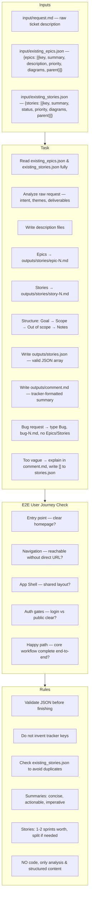

```mermaid
flowchart TD
    subgraph INPUTS["Inputs"]
        I1["input/request.md — raw ticket description"]
        I2["input/existing_epics.json — {epics: [{key, summary, description, priority, diagrams, parent}]}"]
        I3["input/existing_stories.json — {stories: [{key, summary, status, priority, diagrams, parent}]}"]
    end

    subgraph TASK["Task"]
        T1["Read existing_epics.json & existing_stories.json fully"]
        T2["Analyze raw request — intent, themes, deliverables"]
        T3["Write description files"]
        T3a["Epics → outputs/stories/epic-N.md"]
        T3b["Stories → outputs/stories/story-N.md"]
        T3c["Structure: Goal → Scope → Out of scope → Notes"]
        T4["Write outputs/stories.json — valid JSON array"]
        T5["Write outputs/comment.md — tracker-formatted summary"]
        T6["Bug request → type Bug, bug-N.md, no Epics/Stories"]
        T7["Too vague → explain in comment.md, write [] to stories.json"]
    end

    subgraph E2E["E2E User Journey Check"]
        E1["Entry point — clear homepage?"]
        E2["Navigation — reachable without direct URL?"]
        E3["App Shell — shared layout?"]
        E4["Auth gates — login vs public clear?"]
        E5["Happy path — core workflow complete end-to-end?"]
    end

    subgraph RULES["Rules"]
        R1["Validate JSON before finishing"]
        R2["Do not invent tracker keys"]
        R3["Check existing_stories.json to avoid duplicates"]
        R4["Summaries: concise, actionable, imperative"]
        R5["Stories: 1-2 sprints worth, split if needed"]
        R6["NO code, only analysis & structured content"]
    end

    INPUTS --> TASK
    TASK --> E2E
    E2E --> RULES
```
