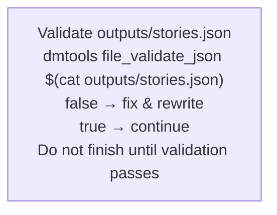

```mermaid
flowchart LR
    V["Validate outputs/stories.json<br/>dmtools file_validate_json $(cat outputs/stories.json)<br/>false → fix & rewrite<br/>true → continue<br/>Do not finish until validation passes"]
```
