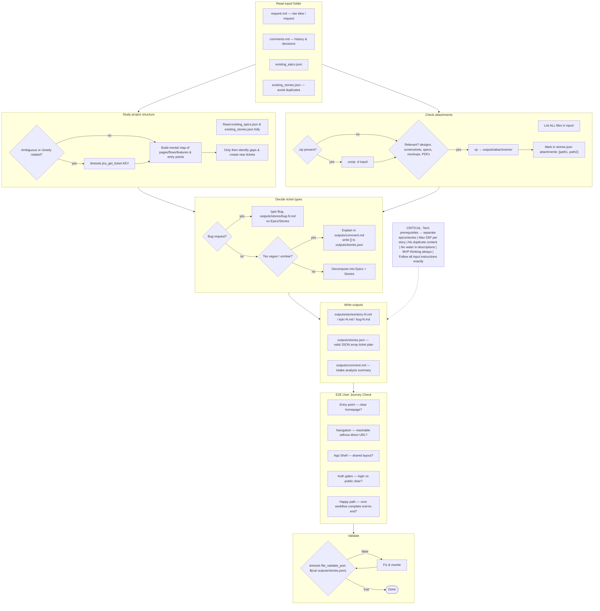

```mermaid
flowchart TD
    subgraph INPUT["Read input/ folder"]
        I1["request.md — raw idea / request"]
        I2["comments.md — history & decisions"]
        I3["existing_epics.json"]
        I4["existing_stories.json — avoid duplicates"]
    end

    subgraph ATTACH["Check attachments"]
        A1["List ALL files in input/"]
        A2{".zip present?"}
        A2 -->|yes| A3["unzip -d input/"]
        A2 -->|no| A4{"Relevant? designs, screenshots, specs, mockups, PDFs"}
        A3 --> A4
        A4 -->|yes| A5["cp → outputs/attachments/"]
        A5 --> A6["Mark in stories.json attachments: [path1, path2]"]
    end

    subgraph STUDY["Study project structure"]
        S1["Read existing_epics.json & existing_stories.json fully"]
        S2{"Ambiguous or closely related?"}
        S2 -->|yes| S3["dmtools jira_get_ticket KEY"]
        S2 -->|no| S4["Build mental map of pages/flows/features & entry points"]
        S3 --> S4
        S4 --> S5["Only then identify gaps & create new tickets"]
    end

    subgraph DECIDE["Decide ticket types"]
        D_BUG{"Bug request?"}
        D_BUG -->|yes| D_BUG_OUT["type Bug, outputs/stories/bug-N.md<br/>no Epics/Stories"]
        D_BUG -->|no| D_VAGUE{"Too vague / unclear?"}
        D_VAGUE -->|yes| D_VAGUE_OUT["Explain in outputs/comment.md<br/>write [] to outputs/stories.json"]
        D_VAGUE -->|no| D_DECOMP["Decompose into Epics + Stories"]
    end

    subgraph OUTPUT["Write outputs"]
        O1["outputs/stories/story-N.md / epic-N.md / bug-N.md"]
        O2["outputs/stories.json — valid JSON array ticket plan"]
        O3["outputs/comment.md — intake analysis summary"]
    end

    subgraph E2E["E2E User Journey Check"]
        E1["Entry point — clear homepage?"]
        E2["Navigation — reachable without direct URL?"]
        E3["App Shell — shared layout?"]
        E4["Auth gates — login vs public clear?"]
        E5["Happy path — core workflow complete end-to-end?"]
    end

    subgraph VALIDATE["Validate"]
        V1{"dmtools file_validate_json $(cat outputs/stories.json)"} -->|false| V2["Fix & rewrite"] --> V1
        V1 -->|true| DONE([Done])
    end

    CR1["CRITICAL: Tech prerequisites → separate epics/stories | Max 5SP per story | No duplicate content | No water in descriptions | MVP thinking always | Follow all input instructions exactly"]

    INPUT --> STUDY
    INPUT --> ATTACH
    STUDY --> DECIDE
    ATTACH --> DECIDE
    DECIDE --> OUTPUT
    OUTPUT --> E2E
    E2E --> VALIDATE
    CR1 -.-> OUTPUT
```
