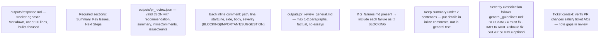

```mermaid
flowchart TD
    F1["outputs/response.md — tracker-agnostic Markdown, under 20 lines, bullet-focused"]
    F2["Required sections: Summary, Key Issues, Next Steps"]
    F3["outputs/pr_review.json — valid JSON with recommendation, summary, inlineComments, issueCounts"]
    F4["Each inline comment: path, line, startLine, side, body, severity (BLOCKING|IMPORTANT|SUGGESTION)"]
    F5["outputs/pr_review_general.md — max 1-2 paragraphs, factual, no essays"]
    F6["If ci_failures.md present → include each failure as 🚨 BLOCKING"]
    F7["Keep summary under 2 sentences — put details in inline comments, not in general text"]
    F8["Severity classification follows general_guidelines.md:<br/>BLOCKING = must fix · IMPORTANT = should fix · SUGGESTION = optional"]
    F9["Ticket context: verify PR changes satisfy ticket ACs — note gaps in review"]
```
