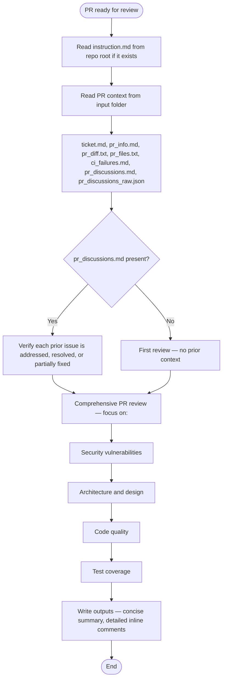

```mermaid
flowchart TD
    START([PR ready for review]) --> PROJ["Read instruction.md from repo root if it exists"]
    PROJ --> INPUT["Read PR context from input folder"]
    INPUT --> INPUTS["ticket.md, pr_info.md, pr_diff.txt, pr_files.txt, ci_failures.md, pr_discussions.md, pr_discussions_raw.json"]
    INPUTS --> REPEATED{pr_discussions.md present?}
    REPEATED -->|Yes| FOLLOW["Verify each prior issue is addressed, resolved, or partially fixed"]
    REPEATED -->|No| FIRST[First review — no prior context]
    FOLLOW --> REVIEW
    FIRST --> REVIEW["Comprehensive PR review — focus on:"]
    REVIEW --> SEC[Security vulnerabilities]
    SEC --> ARCH[Architecture and design]
    ARCH --> CODE[Code quality]
    CODE --> TEST[Test coverage]
    TEST --> OUTPUT["Write outputs — concise summary, detailed inline comments"]
    OUTPUT --> END([End])
```
