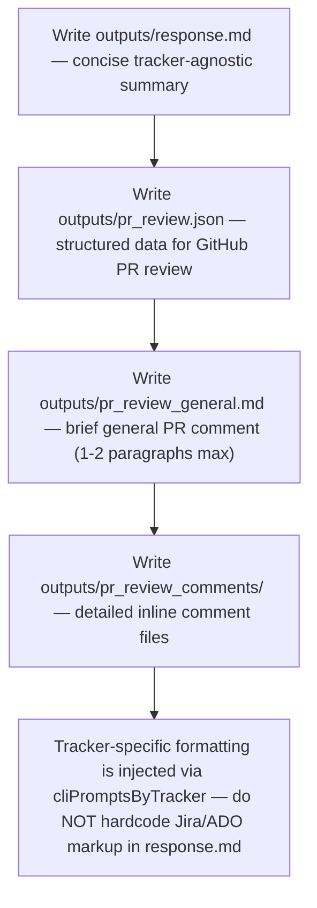

```mermaid
flowchart TD
    O1["Write outputs/response.md — concise tracker-agnostic summary"]
    O2["Write outputs/pr_review.json — structured data for GitHub PR review"]
    O3["Write outputs/pr_review_general.md — brief general PR comment (1-2 paragraphs max)"]
    O4["Write outputs/pr_review_comments/ — detailed inline comment files"]
    O5["Tracker-specific formatting is injected via cliPromptsByTracker — do NOT hardcode Jira/ADO markup in response.md"]
    O1 --> O2 --> O3 --> O4 --> O5
```
