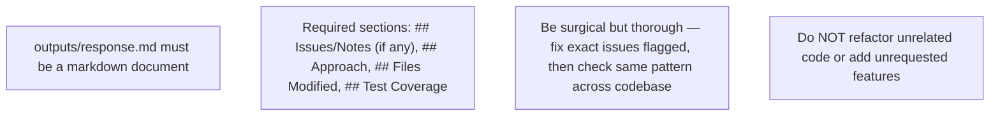

```mermaid
flowchart TD
    F1["outputs/response.md must be a markdown document"]
    F2["Required sections: ## Issues/Notes (if any), ## Approach, ## Files Modified, ## Test Coverage"]
    F3["Be surgical but thorough — fix exact issues flagged, then check same pattern across codebase"]
    F4["Do NOT refactor unrelated code or add unrequested features"]
```
