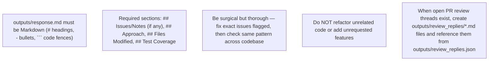

- When `input/<TICKET>/pr_discussions_raw.json` contains open PR review threads:
  - Write one Markdown file per open thread under `outputs/review_replies/`.
  - Write `outputs/review_replies.json` with one entry per open thread, including `inReplyToId`, `threadId`, and a `reply` field that contains the path to the matching `.md` file.
  - Do **not** put reply bodies inline in the JSON.
