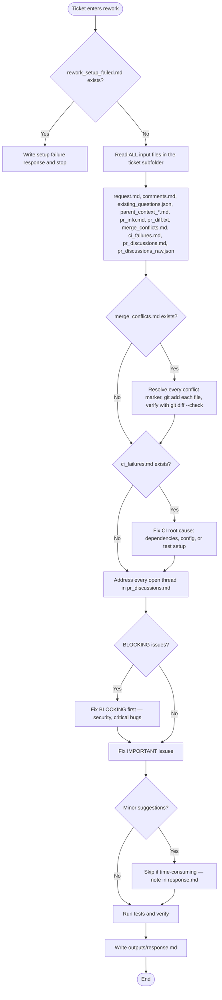
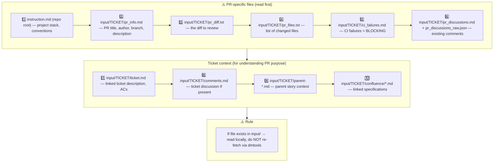

```mermaid
flowchart TD
    START([Ticket enters rework]) --> SETUP{rework_setup_failed.md exists?}
    SETUP -->|Yes| FAIL[Write setup failure response and stop]
    SETUP -->|No| INPUT[Read ALL input files in the ticket subfolder]
    INPUT --> INPUTS["request.md, comments.md, existing_questions.json, parent_context_*.md, pr_info.md, pr_diff.txt, merge_conflicts.md, ci_failures.md, pr_discussions.md, pr_discussions_raw.json"]
    INPUTS --> CONFLICTS{merge_conflicts.md exists?}
    CONFLICTS -->|Yes| RESOLVE["Resolve every conflict marker, git add each file, verify with git diff --check"]
    CONFLICTS -->|No| CI
    RESOLVE --> CI{ci_failures.md exists?}
    CI -->|Yes| FIX_CI["Fix CI root cause: dependencies, config, or test setup"]
    CI -->|No| THREADS
    FIX_CI --> THREADS[Address every open thread in pr_discussions.md]
    THREADS --> BLOCKING{BLOCKING issues?}
    BLOCKING -->|Yes| FIX_BLOCK["Fix BLOCKING first — security, critical bugs"]
    FIX_BLOCK --> IMPORTANT
    BLOCKING -->|No| IMPORTANT[Fix IMPORTANT issues]
    IMPORTANT --> SUGGESTIONS{Minor suggestions?}
    SUGGESTIONS -->|Yes| SKIP["Skip if time-consuming — note in response.md"]
    SUGGESTIONS -->|No| TEST[Run tests and verify]
    SKIP --> TEST
    TEST --> OUTPUT[Write outputs/response.md]
    OUTPUT --> END([End])
```

## 1. Input context — MANDATORY reading order

```mermaid
flowchart TD
    subgraph PR_CONTEXT["⚠️ PR-specific files (read first)"]
        P1["1️⃣ instruction.md (repo root) — project stack, conventions"]
        P2["2️⃣ input/TICKET/pr_info.md — PR title, author, branch, description"]
        P3["3️⃣ input/TICKET/pr_diff.txt — the diff to review"]
        P4["4️⃣ input/TICKET/pr_files.txt — list of changed files"]
        P5["5️⃣ input/TICKET/ci_failures.md — CI failures = BLOCKING"]
        P6["6️⃣ input/TICKET/pr_discussions.md + pr_discussions_raw.json — existing comments"]
        P1 --> P2 --> P3 --> P4 --> P5 --> P6
    end

    subgraph TICKET_CONTEXT["Ticket context (for understanding PR purpose)"]
        T1["7️⃣ input/TICKET/ticket.md — linked ticket description, ACs"]
        T2["8️⃣ input/TICKET/comments.md — ticket discussion if present"]
        T3["9️⃣ input/TICKET/parent-*.md — parent story context"]
        T4["🔟 input/TICKET/confluence/*.md — linked specifications"]
        T1 --> T2 --> T3 --> T4
    end

    subgraph RULE["⚠️ Rule"]
        R1["If file exists in input/ → read locally, do NOT re-fetch via dmtools"]
    end

    PR_CONTEXT --> TICKET_CONTEXT --> RULE
```

Read PR files to understand WHAT changed. Read ticket files to understand WHY it changed and verify against requirements.
