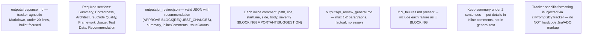

```mermaid
flowchart TD
    F1["outputs/response.md — tracker-agnostic Markdown, under 20 lines, bullet-focused"]
    F2["Required sections: Summary, Correctness, Architecture, Code Quality, Framework Usage, Test Data, Recommendation"]
    F3["outputs/pr_review.json — valid JSON with recommendation (APPROVE|BLOCK|REQUEST_CHANGES), summary, inlineComments, issueCounts"]
    F4["Each inline comment: path, line, startLine, side, body, severity (BLOCKING|IMPORTANT|SUGGESTION)"]
    F5["outputs/pr_review_general.md — max 1-2 paragraphs, factual, no essays"]
    F6["If ci_failures.md present → include each failure as 🚨 BLOCKING"]
    F7["Keep summary under 2 sentences — put details in inline comments, not in general text"]
    F8["Tracker-specific formatting is injected via cliPromptsByTracker — do NOT hardcode Jira/ADO markup"]
```
