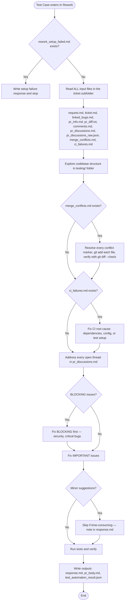

```mermaid
flowchart TD
    START([Test Case enters In Rework]) --> SETUP{rework_setup_failed.md exists?}
    SETUP -->|Yes| FAIL[Write setup failure response and stop]
    SETUP -->|No| INPUT[Read ALL input files in the ticket subfolder]
    INPUT --> INPUTS["request.md, ticket.md, linked_bugs.md, pr_info.md, pr_diff.txt, comments.md, pr_discussions.md, pr_discussions_raw.json, merge_conflicts.md, ci_failures.md"]
    INPUTS --> EXPLORE["Explore codebase structure in testing/ folder"]
    EXPLORE --> CONFLICTS{merge_conflicts.md exists?}
    CONFLICTS -->|Yes| RESOLVE["Resolve every conflict marker, git add each file, verify with git diff --check"]
    CONFLICTS -->|No| CI
    RESOLVE --> CI{ci_failures.md exists?}
    CI -->|Yes| FIX_CI["Fix CI root cause: dependencies, config, or test setup"]
    CI -->|No| THREADS
    FIX_CI --> THREADS[Address every open thread in pr_discussions.md]
    THREADS --> BLOCKING{BLOCKING issues?}
    BLOCKING -->|Yes| FIX_BLOCK["Fix BLOCKING first — security, critical bugs"]
    FIX_BLOCK --> IMPORTANT
    BLOCKING -->|No| IMPORTANT[Fix IMPORTANT issues]
    IMPORTANT --> SUGGESTIONS{Minor suggestions?}
    SUGGESTIONS -->|Yes| SKIP["Skip if time-consuming — note in response.md"]
    SUGGESTIONS -->|No| TEST[Run tests and verify]
    SKIP --> TEST
    TEST --> OUTPUT[Write outputs: response.md, pr_body.md, test_automation_result.json]
    OUTPUT --> END([End])
```
