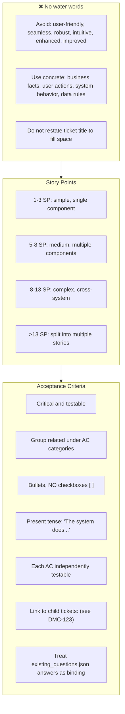

# Enhanced Story Content Guidelines

Keep wording specific and useful; avoid generic filler.

## Examples

- **Business Context**: "Users need secure authentication to protect sensitive data."
- **Out of Scope**: "Advanced features planned for future releases."
