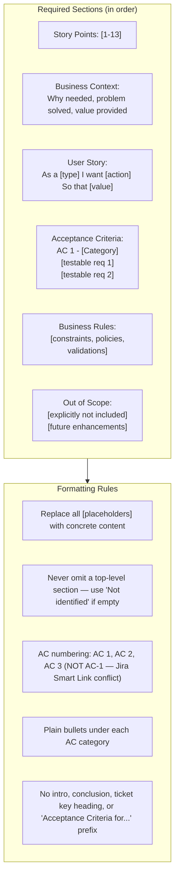

# Enhanced Story Template Guidelines

Use the generic XML-style formatting tags defined in the tracker-specific markup transform file. The transform file converts tags such as `<bold>`, `<bullet>`, and `<heading2>` into the correct syntax for Jira wiki markup or Azure DevOps Markdown.

**IMPORTANT**: Read `input/existing_questions.json` for answered questions as context. Use `dmtools` CLI commands for full ticket details.

**IMPORTANT**: Check child tickets and parent story for better context using the appropriate `dmtools` search command.
