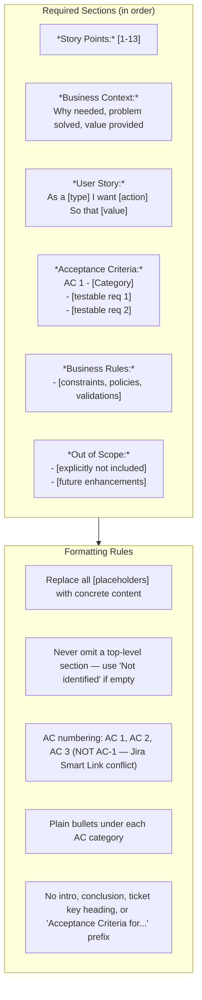

# Enhanced Story Template Guidelines

Use Jira wiki-style markdown. Section headings in bold: `*Heading:*`. No markdown checkboxes.

**IMPORTANT**: Read `input/existing_questions.json` for answered questions as context. Run `dmtools jira_get_ticket KEY` for full details.

**IMPORTANT**: Check child tickets and parent story via `dmtools jira_search_by_jql` for better context.
