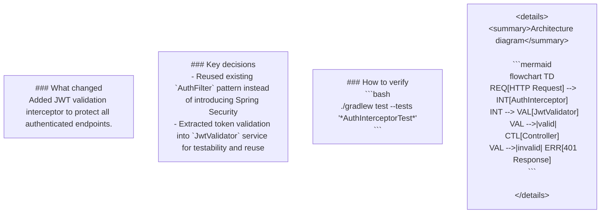

```mermaid
flowchart TD
    E1["### What changed<br/>Added JWT validation interceptor to protect all authenticated endpoints."]
    E2["### Key decisions<br/>- Reused existing `AuthFilter` pattern instead of introducing Spring Security<br/>- Extracted token validation into `JwtValidator` service for testability and reuse"]
    E3["### How to verify<br/>```bash<br/>./gradlew test --tests '*AuthInterceptorTest*'<br/>```"]
    E4["&lt;details&gt;&lt;summary&gt;Architecture diagram&lt;/summary&gt;<br/><br/>```mermaid<br/>flowchart TD<br/>  REQ[HTTP Request] --> INT[AuthInterceptor]<br/>  INT --> VAL[JwtValidator]<br/>  VAL -->|valid| CTL[Controller]<br/>  VAL -->|invalid| ERR[401 Response]<br/>```<br/><br/>&lt;/details&gt;"]
```
