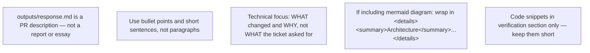

```mermaid
flowchart TD
    F1["outputs/response.md is a PR description — not a report or essay"]
    F2["Use bullet points and short sentences, not paragraphs"]
    F3["Technical focus: WHAT changed and WHY, not WHAT the ticket asked for"]
    F4["If including mermaid diagram: wrap in &lt;details&gt;&lt;summary&gt;Architecture&lt;/summary&gt;...&lt;/details&gt;"]
    F5["Code snippets in verification section only — keep them short"]
```
