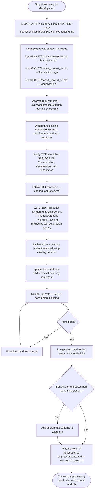

```mermaid
flowchart TD
    START([Story ticket ready for development]) --> READ_INPUT["⚠️ MANDATORY: Read ALL input files FIRST — see instructions/common/input_context_reading.md"]
    READ_INPUT --> PARENT["Read parent epic context if present:<br/>- input/TICKET/parent_context_ba.md — business rules<br/>- input/TICKET/parent_context_sa.md — technical design<br/>- input/TICKET/parent_context_vd.md — visual design"]
    PARENT --> ANALYZE["Analyze requirements — every acceptance criterion must be addressed"]
    ANALYZE --> ARCH["Understand existing codebase patterns, architecture, and test structure"]
    ARCH --> PRINCIPLES["Apply OOP principles: SRP, OCP, DI, Encapsulation, Composition over inheritance"]
    PRINCIPLES --> TDD["Follow TDD approach — see tdd_approach.md"]
    TDD --> TEST_LOC["Write TDD tests in the standard unit-test tree only<br/>— Flutter/Dart: test/<br/>— NEVER in testing/ (owned by test-automation agents)"]
    TEST_LOC --> IMPLEMENT["Implement source code and unit tests following existing patterns"]
    IMPLEMENT --> DOCS["Update documentation ONLY if ticket explicitly requires it"]
    DOCS --> RUN["Run all unit tests — MUST pass before finishing"]
    RUN --> PASS{Tests pass?}
    PASS -->|No| FIX["Fix failures and re-run tests"]
    FIX --> RUN
    PASS -->|Yes| GITSTATUS["Run git status and review every new/modified file"]
    GITSTATUS --> SECRETS{Sensitive or untracked non-code files present?}
    SECRETS -->|Yes| IGNORE["Add appropriate patterns to .gitignore"]
    SECRETS -->|No| SUMMARY["Write concise PR description to outputs/response.md — see output_rules.md"]
    IGNORE --> SUMMARY
    SUMMARY --> END([End — post-processing handles branch, commit and PR])
```
