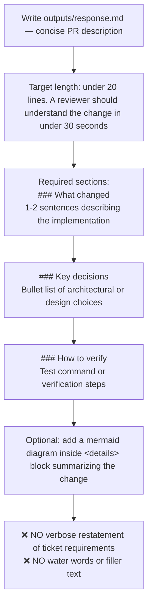

```mermaid
flowchart TD
    O1["Write outputs/response.md — concise PR description"]
    O2["Target length: under 20 lines. A reviewer should understand the change in under 30 seconds"]
    O3["Required sections:<br/>### What changed<br/>1-2 sentences describing the implementation"]
    O4["### Key decisions<br/>Bullet list of architectural or design choices"]
    O5["### How to verify<br/>Test command or verification steps"]
    O6["Optional: add a mermaid diagram inside &lt;details&gt; block summarizing the change"]
    O7["❌ NO verbose restatement of ticket requirements<br/>❌ NO water words or filler text"]
    O1 --> O2 --> O3 --> O4 --> O5 --> O6 --> O7
```
