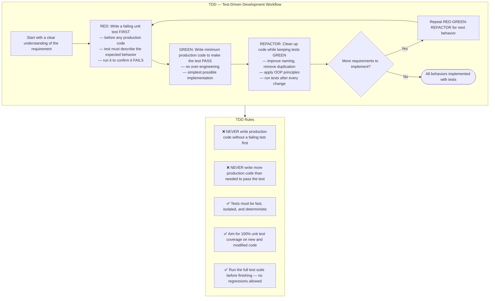

## Where to write TDD tests

Write failing unit / widget tests in the project's standard unit-test tree **only**:

- Flutter / Dart projects → `test/`
- Node projects → `__tests__/` or `test/` according to the repo convention
- Python projects → `tests/` or project-specific unit-test directory

❌ **Never** place development TDD tests under `testing/`.
`testing/` is owned by test-automation agents (regression probes, workflow
observation tests, accessibility gates, etc.). If your production changes break
existing tests there, leave them untouched and mention the breakage in
`outputs/response.md` so the test-automation agent can update them.
