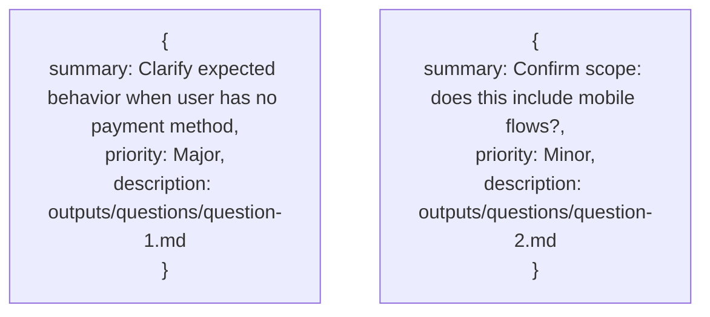

```mermaid
flowchart TD
    E1["{<br/>summary: Clarify expected behavior when user has no payment method,<br/>priority: Major,<br/>description: outputs/questions/question-1.md<br/>}"]
    E2["{<br/>summary: Confirm scope: does this include mobile flows?,<br/>priority: Minor,<br/>description: outputs/questions/question-2.md<br/>}"]
```
