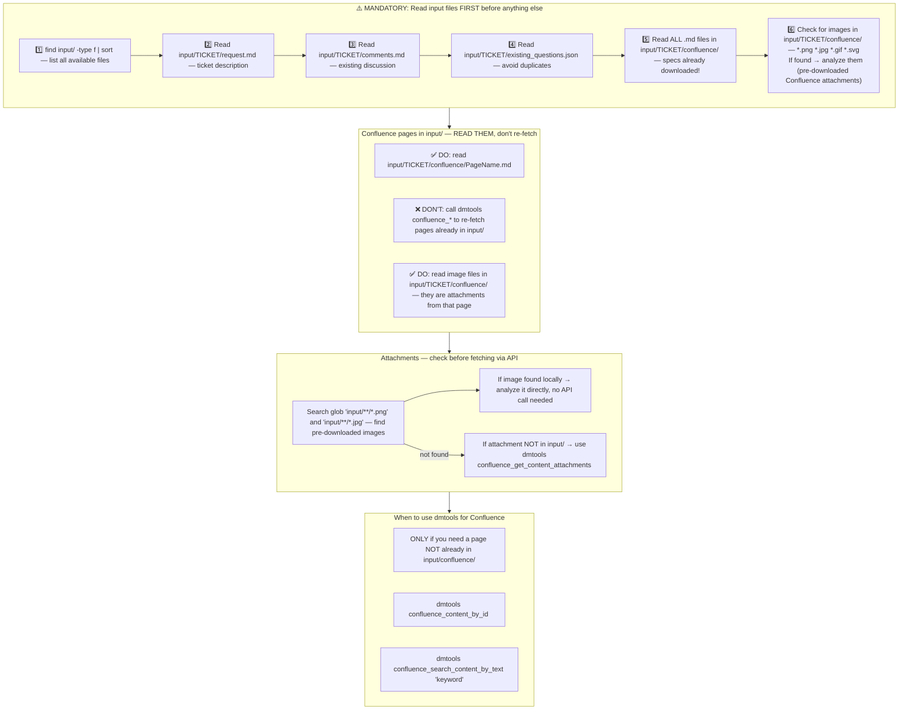

```mermaid
flowchart TD
    subgraph INPUT_ORDER["⚠️ MANDATORY: Read input files FIRST before anything else"]
        I1["1️⃣ find input/ -type f | sort — list all available files"]
        I2["2️⃣ Read input/TICKET/request.md — ticket description"]
        I3["3️⃣ Read input/TICKET/comments.md — existing discussion"]
        I4["4️⃣ Read input/TICKET/existing_questions.json — avoid duplicates"]
        I5["5️⃣ Read ALL .md files in input/TICKET/confluence/ — specs already downloaded!"]
        I6["6️⃣ Check for images in input/TICKET/confluence/ — *.png *.jpg *.gif *.svg\n   If found → analyze them (pre-downloaded Confluence attachments)"]
        I1 --> I2 --> I3 --> I4 --> I5 --> I6
    end

    subgraph CONFLUENCE_RULE["Confluence pages in input/ — READ THEM, don't re-fetch"]
        C1["✅ DO: read input/TICKET/confluence/PageName.md"]
        C2["❌ DON'T: call dmtools confluence_* to re-fetch pages already in input/"]
        C3["✅ DO: read image files in input/TICKET/confluence/ — they are attachments from that page"]
    end

    subgraph ATTACH_RULE["Attachments — check before fetching via API"]
        A1["Search glob 'input/**/*.png' and 'input/**/*.jpg' — find pre-downloaded images"]
        A2["If image found locally → analyze it directly, no API call needed"]
        A3["If attachment NOT in input/ → use dmtools confluence_get_content_attachments <id>"]
        A1 --> A2
        A1 -->|not found| A3
    end

    subgraph DMTOOLS_RULE["When to use dmtools for Confluence"]
        D1["ONLY if you need a page NOT already in input/confluence/"]
        D2["dmtools confluence_content_by_id <id>"]
        D3["dmtools confluence_search_content_by_text 'keyword'"]
    end

    INPUT_ORDER --> CONFLUENCE_RULE --> ATTACH_RULE --> DMTOOLS_RULE
```
