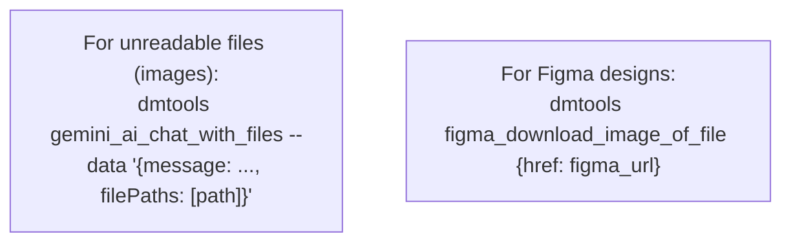

```mermaid
flowchart TD
    F1["For unreadable files (images):<br/>dmtools gemini_ai_chat_with_files --data '{message: ..., filePaths: [path]}'"]
    F2["For Figma designs:<br/>dmtools figma_download_image_of_file {href: figma_url}"]
```
