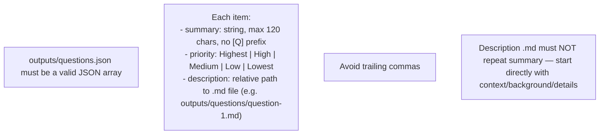

```mermaid
flowchart TD
    F1["outputs/questions.json must be a valid JSON array"]
    F2["Each item:<br/>- summary: string, max 120 chars, no [Q] prefix<br/>- priority: Highest | High | Medium | Low | Lowest<br/>- description: relative path to .md file (e.g. outputs/questions/question-1.md)"]
    F3["Avoid trailing commas"]
    F4["Description .md must NOT repeat summary — start directly with context/background/details"]
```
