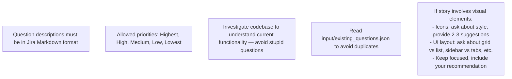

```mermaid
flowchart TD
    G1["Question descriptions must be in Jira Markdown format"]
    G2["Allowed priorities: Highest, High, Medium, Low, Lowest"]
    G3["Investigate codebase to understand current functionality — avoid stupid questions"]
    G4["Read input/existing_questions.json to avoid duplicates"]
    G5["If story involves visual elements:<br/>- Icons: ask about style, provide 2-3 suggestions<br/>- UI layout: ask about grid vs list, sidebar vs tabs, etc.<br/>- Keep focused, include your recommendation"]
```
