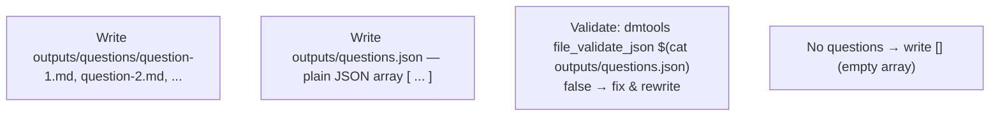

```mermaid
flowchart TD
    O1["Write outputs/questions/question-1.md, question-2.md, ..."]
    O2["Write outputs/questions.json — plain JSON array [ ... ]"]
    O3["Validate: dmtools file_validate_json $(cat outputs/questions.json)<br/>false → fix & rewrite"]
    O4["No questions → write [] (empty array)"]
```
