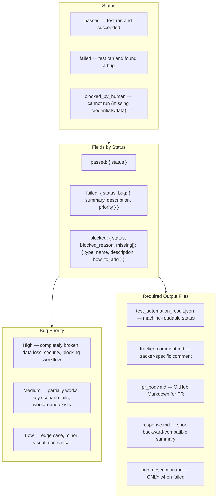

# Test Automation JSON Output Format

Write structured result to `outputs/test_automation_result.json`.



## Examples

### Passed
```json
{ "status": "passed" }
```

### Failed
```json
{
  "status": "failed",
  "bug": {
    "summary": "Bug: [what failed, max 120 chars]",
    "description": "outputs/bug_description.md",
    "priority": "High"
  }
}
```

### Blocked by Human
```json
{
  "status": "blocked_by_human",
  "blocked_reason": "Missing TEST_USER_EMAIL secret — automated test user not configured.",
  "missing": [
    { "type": "secret", "name": "TEST_USER_EMAIL", "description": "Automated test user email", "how_to_add": "gh secret set TEST_USER_EMAIL --body value --repo OWNER/REPO" }
  ]
}
```

## Bug Description Template (when FAILED)

Use tracker-specific format:
- `h4. Environment`
- `h4. Steps to Reproduce` (numbered)
- `h4. Expected Result`
- `h4. Actual Result`
- `h4. Logs / Error Output` (`{code}` block)
- `h4. Notes` (optional)
