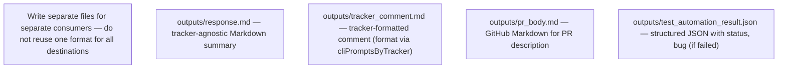

```mermaid
flowchart TD
    F1["Write separate files for separate consumers — do not reuse one format for all destinations"]
    F2["outputs/response.md — tracker-agnostic Markdown summary"]
    F3["outputs/tracker_comment.md — tracker-formatted comment (format via cliPromptsByTracker)"]
    F4["outputs/pr_body.md — GitHub Markdown for PR description"]
    F5["outputs/test_automation_result.json — structured JSON with status, bug (if failed)"]
```
