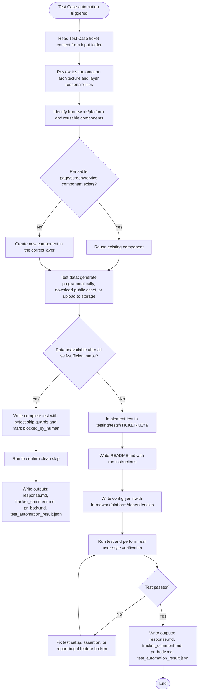

```mermaid
flowchart TD
    START([Test Case automation triggered]) --> READ["Read Test Case ticket context from input folder"]
    READ --> ARCH["Review test automation architecture and layer responsibilities"]
    ARCH --> CHOOSE["Identify framework/platform and reusable components"]
    CHOOSE --> EXISTS{Reusable page/screen/service component exists?}
    EXISTS -->|Yes| REUSE["Reuse existing component"]
    EXISTS -->|No| CREATE["Create new component in the correct layer"]
    REUSE --> DATA["Test data: generate programmatically, download public asset, or upload to storage"]
    CREATE --> DATA
    DATA --> DATABLOCK{Data unavailable after all self-sufficient steps?}
    DATABLOCK -->|Yes| BLOCKED["Write complete test with pytest.skip guards and mark blocked_by_human"]
    DATABLOCK -->|No| IMPLEMENT["Implement test in testing/tests/{TICKET-KEY}/"]
    BLOCKED --> RUNBLOCK["Run to confirm clean skip"]
    RUNBLOCK --> OUTPUTBLOCK["Write outputs: response.md, tracker_comment.md, pr_body.md, test_automation_result.json"]
    IMPLEMENT --> README["Write README.md with run instructions"]
    README --> CONFIG["Write config.yaml with framework/platform/dependencies"]
    CONFIG --> VERIFY["Run test and perform real user-style verification"]
    VERIFY --> PASS{Test passes?}
    PASS -->|No| FIX["Fix test setup, assertion, or report bug if feature broken"]
    FIX --> VERIFY
    PASS -->|Yes| OUTPUT["Write outputs: response.md, tracker_comment.md, pr_body.md, test_automation_result.json"]
    OUTPUT --> END([End])
```
