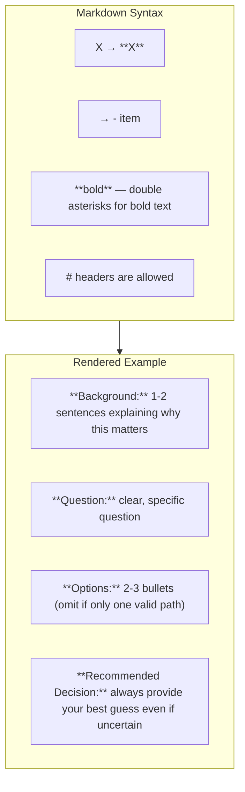

# ADO Question Description Format

When writing question descriptions for Azure DevOps tracker, render the generic formatting tags as Markdown:

| Generic tag | Markdown |
|-------------|----------|
| `<bold>X</bold>` | `**X**` |
| `<bullet>` | `-` |

Additional formatting rules:
- `**bold**` — double asterisks for bold text
- `- item` — dashes for bullet lists
- `# headers` are allowed if needed

