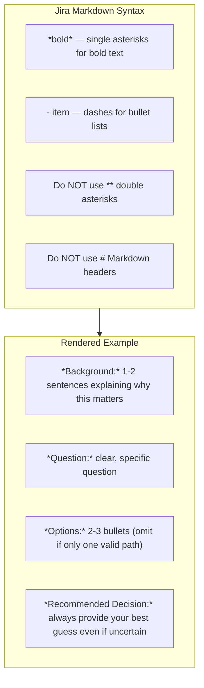

# Jira Question Description Format

When writing question descriptions for Jira tracker, replace the meta tags from the generic template with Jira Markdown equivalents:

| Meta tag | Jira Markdown |
|----------|---------------|
| `{{background}}` | `*Background:*` |
| `{{question}}` | `*Question:*` |
| `{{options}}` | `*Options:*` |
| `{{recommended_decision}}` | `*Recommended Decision:*` |

Formatting rules:
- `*bold*` — single asterisks for bold text
- `- item` — dashes for bullet lists
- Do NOT use `**` double asterisks
- Do NOT use `#` Markdown headers

