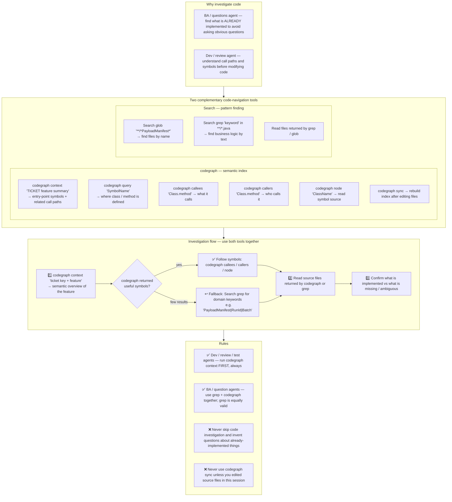

```mermaid
flowchart TD
    subgraph PURPOSE["Why investigate code"]
        P1["BA / questions agent — find what is ALREADY implemented to avoid asking obvious questions"]
        P2["Dev / review agent — understand call paths and symbols before modifying code"]
    end

    subgraph TOOLS["Two complementary code-navigation tools"]
        subgraph CG["codegraph — semantic index"]
            CG1["codegraph context 'TICKET feature summary'\n→ entry-point symbols + related call paths"]
            CG2["codegraph query 'SymbolName'\n→ where class / method is defined"]
            CG3["codegraph callees 'Class.method' → what it calls"]
            CG4["codegraph callers 'Class.method' → who calls it"]
            CG5["codegraph node 'ClassName' → read symbol source"]
            CG6["codegraph sync → rebuild index after editing files"]
        end
        subgraph SR["Search — pattern finding"]
            SR1["Search glob '**/*PayloadManifest*'\n→ find files by name"]
            SR2["Search grep 'keyword' in **/*.java\n→ find business logic by text"]
            SR3["Read files returned by grep / glob"]
        end
    end

    subgraph FLOW["Investigation flow — use both tools together"]
        F1["1️⃣ codegraph context 'ticket key + feature'\n   → semantic overview of the feature"]
        F2{"codegraph returned\nuseful symbols?"}
        F3["✅ Follow symbols: codegraph callees / callers / node"]
        F4["↩️ Fallback: Search grep for domain keywords\n   e.g. 'PayloadManifest|RunId|Batch'"]
        F5["2️⃣ Read source files returned by codegraph or grep"]
        F6["3️⃣ Confirm what is implemented vs what is missing / ambiguous"]
        F1 --> F2
        F2 -->|yes| F3 --> F5
        F2 -->|few results| F4 --> F5
        F5 --> F6
    end

    subgraph RULES["Rules"]
        R1["✅ Dev / review / test agents — run codegraph context FIRST, always"]
        R2["✅ BA / question agents — use grep + codegraph together; grep is equally valid"]
        R3["❌ Never skip code investigation and invent questions about already-implemented things"]
        R4["❌ Never use codegraph sync unless you edited source files in this session"]
    end

    PURPOSE --> TOOLS --> FLOW --> RULES
```
