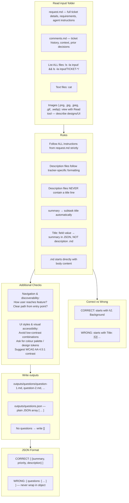

```mermaid
flowchart TD
    subgraph INPUT["Read input/ folder"]
        I1["request.md — full ticket details, requirements, agent instructions"]
        I2["comments.md — ticket history, context, prior decisions"]
        I3["List ALL files: ls -la input/ && ls -la input/TICKET-*/"]
        I4["Text files: cat"]
        I5["Images (.png, .jpg, .jpeg, .gif, .webp): view with Read tool — describe designs/UI"]
    end

    subgraph RULES["Rules"]
        R1["Follow ALL instructions from request.md strictly"]
        R2["Description files follow tracker-specific formatting"]
        R3["Description files NEVER contain a title line"]
        R4["summary → subtask title automatically"]
        R5["Title: field value → summary in JSON, NOT description .md"]
        R6[".md starts directly with body content"]
    end

    subgraph EXAMPLES["Correct vs Wrong"]
        E1["CORRECT: starts with h2. Background"]
        E2["WRONG: starts with Title: [Q] ..."]
    end

    subgraph CHECKS["Additional Checks"]
        C1["Navigation & discoverability:<br/>How user reaches feature?<br/>Clear path from entry point?"]
        C2["UI styles & visual accessibility:<br/>Avoid low-contrast combinations<br/>Ask for colour palette / design tokens<br/>Suggest WCAG AA 4.5:1 contrast"]
    end

    subgraph OUTPUT["Write outputs"]
        O1["outputs/questions/question-1.md, question-2.md, ..."]
        O2["outputs/questions.json — plain JSON array [ ... ]"]
        O3["No questions → write []"]
    end

    subgraph FORMAT["JSON Format"]
        F1["CORRECT: [ {summary, priority, description} ]"]
        F2["WRONG: { questions: [ ... ] } — never wrap in object"]
    end

    INPUT --> RULES
    RULES --> EXAMPLES
    RULES --> CHECKS
    CHECKS --> OUTPUT
    OUTPUT --> FORMAT
```
