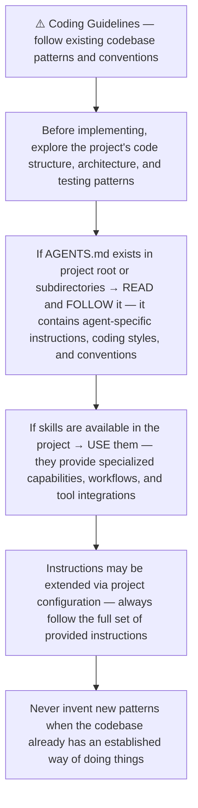
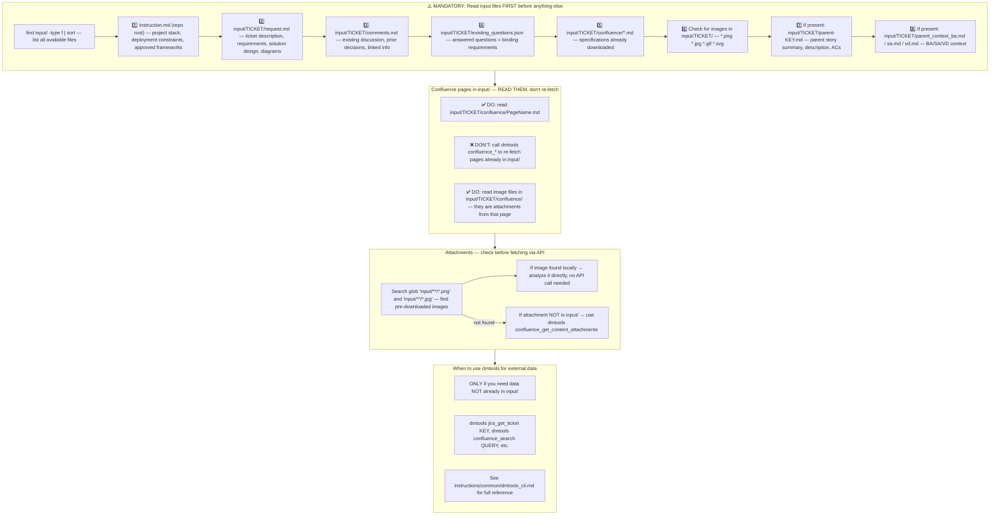
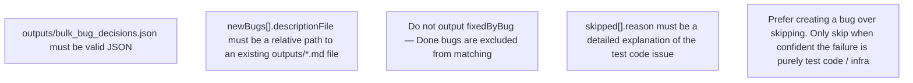
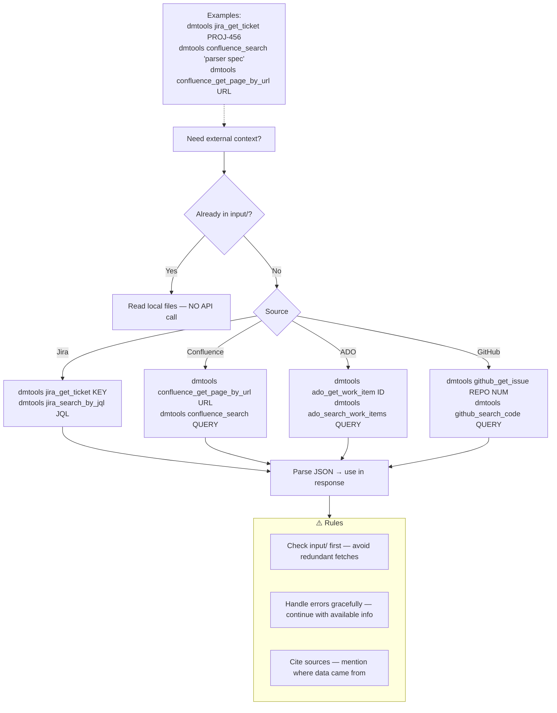
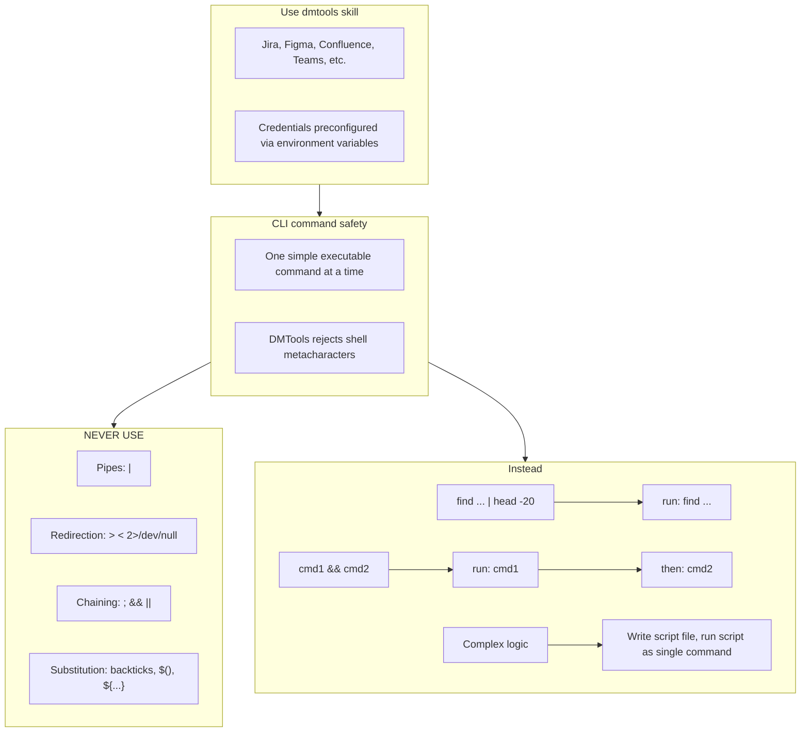

# Agent Snapshot: `bulk_bugs_creation`

- **Context ID**: `bulk_bugs_creation`

## Base cliPrompts

### [1] Role / Plain Text

QA Engineer

---

### [2] `./agents/instructions/common/agent_task_preamble.md`

You are an agent triggered to perform a specific task. All required context — ticket description, PR diff, CI status, and related materials — has already been prepared in the `input/` folder. Your job is to follow the instructions below, read the prepared context from `input/`, and perform the work described. Do not ask for identifiers; the context is already available locally.


---

### [3] `./agents/instructions/common/coding_guidelines.md`




---

### [4] `./agents/instructions/common/input_context_reading.md`




---

### [5] `./agents/instructions/bulk_bugs_creation/general_guidelines.md`

# Bulk Bugs Creation Guidelines

When a Test Case fails and the failure is a real application bug, create or link a Bug ticket.

## Primary failure evidence

1. **`failedReason`** field from the Test Case — this is the most authoritative failure summary.
2. **Attached failed-description file** — the full failure report written by test automation.
3. **Last comment** on the Test Case — supplementary discussion/context.

Use the `failedReason` and attachment content as the basis for every bug `descriptionFile`. Do not rely only on the last comment or test summary.

## Matching existing bugs

Before creating a new bug, check `input/open_bugs.json` for non-Done bugs with:
- the same component/symptom,
- functionally identical summary,
- overlapping reproduction steps (≥70%).

If a match exists, add a `links` entry instead of a `newBugs` entry.

## When to skip

Only skip a failed TC as a `skipped` entry when you are confident the failure is purely:
- test-code issue,
- infra/flake,
- outdated selector/locator.

Prefer creating a bug over skipping.

## Grouping

If multiple failed TCs share the same root cause, group them under one `newBugs` entry with all linked TC keys.


---

### [6] `./agents/instructions/bulk_bugs_creation/output_rules.md`

# Bulk Bug Creation Output Rules

## Required JSON

Write `outputs/bulk_bug_decisions.json`:

```json
{
  "processed": ["TS-984", "TS-954", "TS-909"],
  "newBugs": [
    {
      "summary": "...",
      "priority": "High|Medium|Low",
      "descriptionFile": "outputs/bug_001_description.md",
      "linkedTCs": ["TS-984", "TS-954"]
    }
  ],
  "links": [
    { "tcKey": "TS-909", "bugKey": "TS-123" }
  ],
  "skipped": [
    {
      "tcKey": "TS-800",
      "reason": "Detailed reason why this is a test-code issue"
    }
  ]
}
```

### Rules

- `processed` must list every TC the AI made a decision for.
- `newBugs[].descriptionFile` must point to an existing `outputs/bug_NNN_description.md`.
- The description file must incorporate the TC's `failedReason` field and any attached failed-description file content.
- Do not embed multi-line description text directly inside `bulk_bug_decisions.json`.
- Do not output `fixedByBug` — Done bugs are excluded from matching.
- `skipped[].reason` must be detailed and specific.


---

### [7] `./agents/instructions/bulk_bugs_creation/formatting_rules.md`




---

### [8] `./agents/instructions/bulk_bugs_creation/few_shots.md`

Example bulk bug decisions output:

```json
{
  "processed": ["TS-984", "TS-954", "TS-909"],
  "newBugs": [
    {
      "summary": "Login button unresponsive on iOS Safari",
      "priority": "High",
      "descriptionFile": "outputs/bug_001_description.md",
      "linkedTCs": ["TS-984", "TS-954"]
    }
  ],
  "links": [
    { "tcKey": "TS-909", "bugKey": "TS-123" }
  ],
  "skipped": [
    {
      "tcKey": "TS-800",
      "reason": "Flaky CSS selector '.btn-primary' no longer matches after UI refactor — test code issue, not app bug"
    }
  ]
}
```


---

### [9] `./agents/instructions/common/dmtools_cli.md`

## DMTools CLI — External Data Access

> **PR Review note**: Ticket/PR context is pre-loaded. Use dmtools only for additional data (e.g., parent story details, linked tickets not in input/).

Use `dmtools` CLI only when data is **not** already in `input/`.




---

### [10] `./agents/prompts/bash_tools.md`




---

## cliPromptsByTracker

### Tracker: `jira`

#### [1] `./agents/instructions/tracker/jira_comment_format.md`

# Jira tracker comment

Use Jira wiki markup in `outputs/response.md`.

- Headings: `h1.`, `h2.`, `h3.`
- Bullets: `* item`
- Numbered lists: `# item`
- Bold: `*text*`
- Inline code: `{{code}}`
- Code block: `{code}...{code}`
- Link: `[title|url]`

Do not use Markdown headings, fenced code blocks, or backtick inline code.

**IMPORTANT** When answering a clarification question about a user story, get the parent story for full context using: `dmtools jira_get_ticket PARENT-KEY` (the parent key is visible in the ticket's parent field).


---

### Tracker: `ado`

#### [1] `./agents/instructions/tracker/ado_comment_format.md`

# ADO tracker comment

Use GitHub-flavored Markdown in `outputs/response.md` for Azure DevOps work item comments and descriptions.

- Headings: `#`, `##`, `###`
- Bullets: `- item` or `* item`
- Numbered lists: `1. item`
- Bold: `**text**`
- Inline code: `` `code` ``
- Code block: ` ```lang ... ``` `
- Link: `[title](url)`
- Tables: standard GFM table syntax

Do not use Jira wiki markup (`h1.`, `*text*`, `{code}`, `[title|url]`) in ADO fields.

**IMPORTANT** When answering a clarification question about a user story, get the parent story for full context using: `dmtools ado_get_work_item PARENT-KEY` (the parent key is visible in the ticket's parent field).

**IMPORTANT** When enhancing story descriptions, check child tickets and parent story for better context using: `dmtools ado_search_by_wiql`.


---
